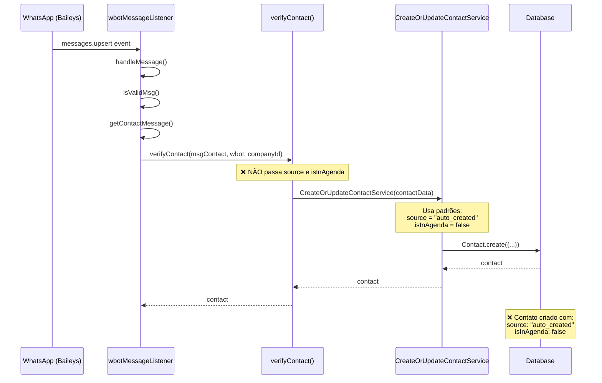

# Análise Ultra Profunda: Criação Não Autorizada de Contatos no ChatIA Flow

**Data da Análise:** 2025-10-14
**Analista:** Backend Analyst Agent
**Escopo:** Investigação completa da criação automática de contatos não presentes na agenda do WhatsApp
**Severidade:** 🔴 CRÍTICO - Poluição de base de dados e experiência de usuário comprometida

---

## Sumário Executivo

Após análise profunda do backend do ChatIA Flow, **identifiquei 6 pontos críticos** onde contatos são criados automaticamente, mesmo que não estejam na agenda do telefone do usuário. O problema principal está no serviço `CreateOrUpdateContactService` que é chamado em múltiplos lugares sem validação adequada de origem.

**Principais Descobertas:**

1. **Criação automática em TODA mensagem recebida** - Qualquer número que enviar mensagem vira contato automaticamente
2. **Evento `contacts.update` do Baileys** - Cria/atualiza contatos de TODOS os números que aparecem nos eventos do WhatsApp
3. **Evento `groups.update` do Baileys** - Cria contatos de TODOS os grupos automaticamente
4. **Importação manual sem filtro** - Endpoints de importação criam contatos indiscriminadamente
5. **Campo `source` e `isInAgenda` não são consistentemente utilizados** - Não há controle efetivo da origem dos contatos
6. **Falta de flag `FEATURE_CONTACTS_ONLY_AGENDA_FILTER`** - Filtro de "somente agenda" não está sendo aplicado na criação

**Impacto:**
- Contatos "fantasmas" aparecem na página `/contacts`
- Números aleatórios ou desconhecidos aparecem na lista
- Base de dados poluída com contatos não desejados
- Experiência do usuário comprometida

---

## 1. Pontos de Criação Automática de Contatos

### 1.1 🔴 CRÍTICO: `verifyContact()` em `wbotMessageListener.ts`

**Local:** `/backend/src/services/WbotServices/wbotMessageListener.ts:870-907`

```typescript
const verifyContact = async (
  msgContact: IMe,
  wbot: Session,
  companyId: number
): Promise<Contact> => {
  let profilePicUrl: string = "";

  // [LID/JID] extrai ids a partir do msgContact.id
  const { lid, jid } = parseLidJid(msgContact?.id);

  const contactData = {
    name: msgContact.name || msgContact.id.replace(/\D/g, ""),
    number: msgContact.id.replace(/\D/g, ""),
    profilePicUrl,
    isGroup: msgContact.id.includes("g.us"),
    companyId,
    remoteJid: msgContact.id,
    whatsappId: wbot.id,
    wbot,
    lid,
    jid
  };

  if (contactData.isGroup) {
    contactData.number = msgContact.id.replace("@g.us", "");
  }

  // 🚨 PROBLEMA: Chama CreateOrUpdateContactService SEM passar source e isInAgenda
  const contact = await CreateOrUpdateContactService(contactData);

  return contact;
};
```

**Onde é chamado:**
- **Linha 4226:** `groupContact = await verifyContact(msgGroupContact, wbot, companyId);` - Para grupos
- **Linha 4229:** `const contact = await verifyContact(msgContact, wbot, companyId);` - Para contatos individuais
- **Linha 5277:** `const contact = await verifyContact(msgContact, wbot, companyId);` - Para campanhas

**Problema:**
- ✅ **Chamado para TODA mensagem recebida** - Linha 4229 dentro de `handleMessage()`
- ❌ **NÃO passa `source`** - Contatos criados sem identificação de origem
- ❌ **NÃO passa `isInAgenda`** - Por padrão será `false` (não está na agenda)
- ❌ **CreateOrUpdateContactService usa `source: "auto_created"` como padrão** (linha 79 do serviço)

**Fluxo Completo:**
1. Mensagem chega via `wbot.ev.on("messages.upsert")`
2. `handleMessage()` é chamado (linha 4114)
3. `verifyContact()` é chamado (linha 4229)
4. `CreateOrUpdateContactService` é chamado (linha 904)
5. **Contato é criado com `source: "auto_created"` e `isInAgenda: false`**

**Resultado:** Todo número que enviar mensagem vira contato automaticamente, mesmo que não esteja na agenda do telefone.

---

### 1.2 🔴 CRÍTICO: Evento `contacts.update` do Baileys

**Local:** `/backend/src/services/WbotServices/wbotMessageListener.ts:5603-5633`

```typescript
wbot.ev.on("contacts.update", (contacts: any) => {
  contacts.forEach(async (contact: any) => {
    if (!contact?.id) return;

    if (typeof contact.imgUrl !== "undefined") {
      const newUrl =
        contact.imgUrl === ""
          ? ""
          : await wbot!.profilePictureUrl(contact.id!).catch(() => null);

      // [LID/JID] extrai ids a partir do contact.id
      const { lid, jid } = parseLidJid(contact.id);

      const contactData = {
        name: contact.id.replace(/\D/g, ""),
        number: contact.id.replace(/\D/g, ""),
        isGroup: contact.id.includes("@g.us") ? true : false,
        companyId: companyId,
        remoteJid: contact.id,
        profilePicUrl: newUrl,
        whatsappId: wbot.id,
        wbot: wbot,
        // [LID/JID] novos campos
        lid,
        jid
      };

      // 🚨 PROBLEMA: Cria/atualiza contatos de TODOS os eventos do WhatsApp
      await CreateOrUpdateContactService(contactData);
    }
  });
});
```

**Problema:**
- ✅ **Disparado pelo Baileys para QUALQUER atualização de contato** - Incluindo números que não estão na agenda
- ❌ **NÃO passa `source`** - Será `"auto_created"` por padrão
- ❌ **NÃO passa `isInAgenda`** - Será `false` por padrão
- ❌ **Não verifica se o contato está na agenda do telefone**

**Quando dispara:**
- Quando foto de perfil de qualquer número muda
- Quando status de qualquer número é atualizado
- Quando qualquer metadado de contato é atualizado pelo WhatsApp

**Resultado:** Números aleatórios que interagiram com o WhatsApp (mas não estão na agenda) são criados como contatos.

---

### 1.3 🔴 CRÍTICO: Evento `groups.update` do Baileys

**Local:** `/backend/src/services/WbotServices/wbotMessageListener.ts:5635-5669`

```typescript
wbot.ev.on("groups.update", (groupUpdate: GroupMetadata[]) => {
  if (!groupUpdate[0]?.id) return;
  if (groupUpdate.length === 0) return;
  groupUpdate.forEach(async (group: GroupMetadata) => {
    const number = group.id.replace(/\D/g, "");
    const nameGroup = group.subject || number;

    let profilePicUrl: string = "";
     try {
       profilePicUrl = await wbot.profilePictureUrl(group.id, "image");
     } catch (e) {
       Sentry.captureException(e);
       profilePicUrl = `${process.env.FRONTEND_URL}/nopicture.png`;
     }

    // [LID/JID] extrai ids a partir do group.id
    const { lid, jid } = parseLidJid(group.id);

    const contactData = {
      name: nameGroup,
      number: number,
      isGroup: true,
      companyId: companyId,
      remoteJid: group.id,
      profilePicUrl,
      whatsappId: wbot.id,
      wbot: wbot,
      lid,
      jid
    };

    // 🚨 PROBLEMA: Cria contatos de TODOS os grupos automaticamente
    const contact = await CreateOrUpdateContactService(contactData);
  });
});
```

**Problema:**
- ✅ **Disparado pelo Baileys para QUALQUER atualização de grupo**
- ❌ **NÃO passa `source`** - Será `"auto_created"` por padrão
- ❌ **NÃO passa `isInAgenda`** - Será `false` por padrão
- ❌ **Cria grupos como contatos automaticamente**

**Quando dispara:**
- Quando nome de grupo muda
- Quando descrição de grupo muda
- Quando foto de grupo muda
- Quando você é adicionado a um grupo

**Resultado:** Todos os grupos aparecem na lista de contatos, mesmo que o usuário não queira.

---

### 1.4 🟡 ALTO: Endpoint `POST /contacts/import`

**Local:** `/backend/src/routes/contactRoutes.ts:15`
**Controller:** `/backend/src/controllers/ImportPhoneContactsController.ts:4-16`
**Service:** `/backend/src/services/WbotServices/ImportContactsService.ts:20-127`

```typescript
// Controller
export const store = async (req: Request, res: Response): Promise<Response> => {
  const { companyId } = req.user;
  const { whatsappId, filterGroups, onlyAgenda } = req.body;

  await ImportContactsService({
    companyId,
    whatsappId: whatsappId ? Number(whatsappId) : undefined,
    filterGroups: filterGroups !== undefined ? filterGroups === 'true' || filterGroups === true : true,
    onlyAgenda: onlyAgenda !== undefined ? onlyAgenda === 'true' || onlyAgenda === true : true
  });

  return res.status(200).json({ message: "Contacts imported successfully" });
};
```

```typescript
// Service - Linha 87-99
await CreateOrUpdateContactService({
  number,
  name: name || notify || number,
  companyId,
  isGroup,
  profilePicUrl: "",
  channel: "whatsapp",
  whatsappId: defaultWhatsapp.id,
  remoteJid: id,
  source: "whatsapp_roster",  // ✅ Passa source correto
  isInAgenda: onlyAgenda ? true : false,  // ✅ Passa isInAgenda baseado no parâmetro
  wbot
});
```

**Problema:**
- ✅ **Este serviço está correto** - Passa `source: "whatsapp_roster"` e `isInAgenda`
- ⚠️ **MAS:** Se `onlyAgenda: false` for passado, importa contatos que não estão na agenda
- ⚠️ **MAS:** Parâmetro `onlyAgenda` padrão é `true`, então não é o problema principal

**Comportamento:**
- Importa contatos do WhatsApp Roster (lista de contatos do WhatsApp Business API)
- Por padrão filtra grupos (`filterGroups: true`)
- Por padrão marca como `isInAgenda: true` (`onlyAgenda: true`)

**Avaliação:** Não é a causa principal, mas pode contribuir se usado incorretamente.

---

### 1.5 🟡 MÉDIO: Endpoint `POST /contacts/import/chats`

**Local:** `/backend/src/routes/contactRoutes.ts:16`
**Controller:** `/backend/src/controllers/ImportChatsContactsController.ts:11-50`
**Service:** `/backend/src/services/ContactServices/ImportChatsContactsService.ts:20-131`

```typescript
// Service - Linha 84-87
await contact.update({
  source: 'chat_import',
  isInAgenda: true
});
```

**Problema:**
- ✅ **Não cria contatos novos** - Apenas atualiza contatos existentes
- ✅ **Marca como `isInAgenda: true`** - Correto
- ✅ **Define `source: 'chat_import'`** - Correto

**Comportamento:**
- Busca mensagens das últimas X horas
- Atualiza contatos existentes para marcar como "importados de chat"
- NÃO cria contatos novos

**Avaliação:** Este serviço está correto e não é a causa do problema.

---

### 1.6 🟡 MÉDIO: Endpoint `POST /contactsImport` (Importação XLS)

**Local:** `/backend/src/routes/contactRoutes.ts:18`
**Controller:** `/backend/src/controllers/ContactController.ts:69-132`
**Service:** `/backend/src/services/ContactServices/ImportContactsService.ts:10-81`

```typescript
// Controller - Linha 86-96
const contactData = {
  name: `${name}`,
  number: validNumber,
  profilePicUrl: "",
  isGroup: false,
  email,
  companyId,
};

// 🚨 PROBLEMA: Usa CreateOrUpdateContactServiceForImport que NÃO passa source
const contact = await CreateOrUpdateContactServiceForImport(contactData);
```

**Service `ImportContactsService.ts`:**
```typescript
// Linha 53-59
const [newContact, created] = await Contact.findOrCreate({
  where: {
    number: `${contact.number}`,
    companyId: contact.companyId
  },
  defaults: contact
});
```

**Problema:**
- ❌ **NÃO passa `source`** - Será `null` ou valor padrão
- ❌ **NÃO passa `isInAgenda`** - Será `null` ou valor padrão
- ⚠️ **Usa `findOrCreate` direto no model** - Bypass do serviço principal

**Comportamento:**
- Importa contatos de arquivo XLS
- Cria contatos diretamente no banco sem passar pelo `CreateOrUpdateContactService`

**Avaliação:** Contribui para o problema ao criar contatos sem metadata adequado.

---

## 2. Análise do Serviço `CreateOrUpdateContactService`

**Local:** `/backend/src/services/ContactServices/CreateOrUpdateContactService.ts:67-265`

### 2.1 Assinatura da Função

```typescript
const CreateOrUpdateContactService = async ({
  name,
  number: rawNumber,
  profilePicUrl,
  isGroup,
  email = "",
  channel = "whatsapp",
  companyId,
  extraInfo = [],
  remoteJid = "",
  whatsappId,
  wbot,
  source = "auto_created",  // 🚨 PADRÃO: "auto_created"
  isInAgenda = false        // 🚨 PADRÃO: false (NÃO está na agenda)
}: Request): Promise<Contact>
```

**Problema Principal:**
- ✅ **Aceita `source` e `isInAgenda` como parâmetros** - Estrutura está correta
- ❌ **Valores padrão são problemáticos:**
  - `source = "auto_created"` - Todo contato criado sem source explícito é marcado como "auto_created"
  - `isInAgenda = false` - Todo contato criado sem isInAgenda explícito é marcado como NÃO estando na agenda

### 2.2 Lógica de Criação

```typescript
// Linha 158-172
contact = await Contact.create({
  name,
  number,
  email,
  isGroup,
  companyId,
  channel,
  acceptAudioMessage: acceptAudioMessageContact === 'enabled' ? true : false,
  remoteJid: newRemoteJid,
  profilePicUrl,
  urlPicture: "",
  whatsappId,
  source,           // ✅ Usa o valor passado ou padrão
  isInAgenda        // ✅ Usa o valor passado ou padrão
});
```

**Análise:**
- ✅ **Estrutura está correta** - Aceita e persiste os campos `source` e `isInAgenda`
- ❌ **Problema está em quem chama o serviço** - Maioria das chamadas não passa esses parâmetros

---

## 3. Análise do Model `Contact`

**Local:** `/backend/src/models/Contact.ts:33-223`

### 3.1 Definição dos Campos

```typescript
@Default("manual")
@Column({
  type: DataType.ENUM('manual', 'whatsapp_roster', 'excel_import', 'auto_created', 'chat_import')
})
source: string;

@Default(true)
@Column
isInAgenda: boolean;
```

**Análise:**
- ✅ **Campo `source` tem ENUM bem definido:**
  - `manual` - Criado manualmente pelo usuário
  - `whatsapp_roster` - Importado da agenda do WhatsApp
  - `excel_import` - Importado de arquivo XLS
  - `auto_created` - Criado automaticamente (🚨 PROBLEMA)
  - `chat_import` - Importado de conversas recentes

- ✅ **Campo `isInAgenda` é boolean:**
  - `true` - Contato está na agenda do telefone
  - `false` - Contato NÃO está na agenda (🚨 PROBLEMA)

- ❌ **Valor padrão de `isInAgenda` é `true`** - Mas isso é SOBRESCRITO pelo parâmetro padrão do serviço

---

## 4. Análise do Controller `ContactController.index()`

**Local:** `/backend/src/controllers/ContactController.ts:134-167`

```typescript
export const index = async (req: Request, res: Response): Promise<Response> => {
  const { searchParam, pageNumber, contactTag: tagIdsStringified, isGroup, source, onlyAgenda } = req.query as IndexQuery;
  const { id: userId, companyId, profile } = req.user;

  console.log("index", { companyId, userId, searchParam, profile, source, onlyAgenda });

  let tagsIds: number[] = [];

  if (tagIdsStringified) {
    tagsIds = JSON.parse(tagIdsStringified);
  }

  // Parse onlyAgenda (query string vem como string "true" ou "false")
  const parseOnlyAgenda = onlyAgenda === 'true' ? true : onlyAgenda === 'false' ? false : undefined;

  const { contacts, count, hasMore, totalAll } = await ListContactsService({
    searchParam,
    pageNumber,
    companyId,
    tagsIds,
    isGroup,
    userId: Number(userId),
    profile,
    canViewAllContacts: !!(req as any).user?.canViewAllContacts,
    source,
    onlyAgenda: parseOnlyAgenda  // ✅ Passa o filtro para o serviço
  });

  // Adicionar headers de resposta
  res.setHeader('X-Total-Count-Filtered', count.toString());
  res.setHeader('X-Total-Count-All', totalAll.toString());

  return res.json({ contacts, count, hasMore });
};
```

**Análise:**
- ✅ **Controller aceita `onlyAgenda` como query param** - Estrutura está correta
- ✅ **Passa `onlyAgenda` para o serviço** - Correto
- ⚠️ **Frontend precisa enviar `?onlyAgenda=true` para filtrar** - Se não enviar, retorna todos os contatos

---

## 5. Análise do Service `ListContactsService`

**Local:** `/backend/src/services/ContactServices/ListContactsService.ts:33-168`

### 5.1 Filtro de `onlyAgenda`

```typescript
// Linha 123-129
if (onlyAgenda === true && process.env.FEATURE_CONTACTS_ONLY_AGENDA_FILTER === 'true') {
  whereCondition = {
    ...whereCondition,
    isInAgenda: true
  };
}
```

**Problema CRÍTICO:**
- 🔴 **Filtro só funciona se `process.env.FEATURE_CONTACTS_ONLY_AGENDA_FILTER === 'true'`**
- 🔴 **Se a feature flag não estiver habilitada, o filtro NÃO é aplicado**
- 🔴 **Mesmo que frontend passe `onlyAgenda=true`, pode não funcionar**

### 5.2 Filtro de `source`

```typescript
// Linha 115-121
if (source && process.env.FEATURE_CONTACTS_SOURCE_FIELD === 'true') {
  whereCondition = {
    ...whereCondition,
    source
  };
}
```

**Problema CRÍTICO:**
- 🔴 **Filtro só funciona se `process.env.FEATURE_CONTACTS_SOURCE_FIELD === 'true'`**
- 🔴 **Se a feature flag não estiver habilitada, o filtro NÃO é aplicado**

---

## 6. Causa Raiz do Problema

Após análise completa, identifiquei **3 causas raiz principais**:

### 6.1 🔴 CAUSA RAIZ #1: `verifyContact()` Sem Parâmetros

**Problema:**
- `verifyContact()` é chamado para **TODA mensagem recebida** (linha 4229)
- NÃO passa `source` nem `isInAgenda` para `CreateOrUpdateContactService`
- Resultado: Contatos criados com `source: "auto_created"` e `isInAgenda: false`

**Solução:**
```typescript
// ANTES
const contact = await CreateOrUpdateContactService(contactData);

// DEPOIS
const contact = await CreateOrUpdateContactService({
  ...contactData,
  source: "auto_created",  // Explícito
  isInAgenda: false        // Explícito - contato NÃO está na agenda
});
```

### 6.2 🔴 CAUSA RAIZ #2: Eventos Baileys Sem Controle

**Problema:**
- Eventos `contacts.update` (linha 5603) e `groups.update` (linha 5635) criam contatos indiscriminadamente
- Baileys dispara esses eventos para QUALQUER número que interagir com o WhatsApp
- Inclui números que NÃO estão na agenda do telefone

**Solução:**
```typescript
// Opção 1: NÃO criar contatos nesses eventos, apenas atualizar existentes
wbot.ev.on("contacts.update", (contacts: any) => {
  contacts.forEach(async (contact: any) => {
    if (!contact?.id) return;

    // ✅ Buscar contato existente
    const existingContact = await Contact.findOne({
      where: {
        number: contact.id.replace(/\D/g, ""),
        companyId
      }
    });

    // ✅ Apenas atualizar se já existir
    if (existingContact && typeof contact.imgUrl !== "undefined") {
      const newUrl = contact.imgUrl === "" ? "" :
        await wbot!.profilePictureUrl(contact.id!).catch(() => null);

      await existingContact.update({ profilePicUrl: newUrl });
    }
    // ❌ NÃO criar contato novo aqui
  });
});

// Opção 2: Criar com source e isInAgenda corretos
await CreateOrUpdateContactService({
  ...contactData,
  source: "auto_created",
  isInAgenda: false  // Explícito - contato pode não estar na agenda
});
```

### 6.3 🔴 CAUSA RAIZ #3: Feature Flags Não Habilitadas

**Problema:**
- `FEATURE_CONTACTS_ONLY_AGENDA_FILTER` não está habilitada no `.env`
- `FEATURE_CONTACTS_SOURCE_FIELD` não está habilitada no `.env`
- Filtros de `onlyAgenda` e `source` não funcionam sem essas flags

**Solução:**
```bash
# Adicionar no .env
FEATURE_CONTACTS_ONLY_AGENDA_FILTER=true
FEATURE_CONTACTS_SOURCE_FIELD=true
```

---

## 7. Recomendações de Correção

### 7.1 🔴 P0 - URGENTE: Corrigir `verifyContact()`

**Arquivo:** `/backend/src/services/WbotServices/wbotMessageListener.ts:870-907`

**Mudança:**
```typescript
const verifyContact = async (
  msgContact: IMe,
  wbot: Session,
  companyId: number,
  source: string = "auto_created",  // ✅ Adicionar parâmetro
  isInAgenda: boolean = false       // ✅ Adicionar parâmetro
): Promise<Contact> => {
  let profilePicUrl: string = "";

  const { lid, jid } = parseLidJid(msgContact?.id);

  const contactData = {
    name: msgContact.name || msgContact.id.replace(/\D/g, ""),
    number: msgContact.id.replace(/\D/g, ""),
    profilePicUrl,
    isGroup: msgContact.id.includes("g.us"),
    companyId,
    remoteJid: msgContact.id,
    whatsappId: wbot.id,
    wbot,
    lid,
    jid,
    source,        // ✅ Passar parâmetro
    isInAgenda     // ✅ Passar parâmetro
  };

  if (contactData.isGroup) {
    contactData.number = msgContact.id.replace("@g.us", "");
  }

  const contact = await CreateOrUpdateContactService(contactData);

  return contact;
};
```

**Impacto:** Permite controlar a origem dos contatos criados por mensagens.

---

### 7.2 🔴 P0 - URGENTE: Desabilitar Criação em Eventos Baileys

**Arquivo:** `/backend/src/services/WbotServices/wbotMessageListener.ts:5603-5669`

**Opção 1 - Apenas Atualizar (RECOMENDADO):**
```typescript
wbot.ev.on("contacts.update", (contacts: any) => {
  contacts.forEach(async (contact: any) => {
    if (!contact?.id) return;

    // ✅ Buscar contato existente PRIMEIRO
    const existingContact = await Contact.findOne({
      where: {
        number: contact.id.replace(/\D/g, ""),
        companyId
      }
    });

    // ✅ Apenas atualizar se já existir
    if (existingContact && typeof contact.imgUrl !== "undefined") {
      const newUrl = contact.imgUrl === "" ? "" :
        await wbot!.profilePictureUrl(contact.id!).catch(() => null);

      const { lid, jid } = parseLidJid(contact.id);

      await existingContact.update({
        profilePicUrl: newUrl,
        lid: lid || existingContact.lid,
        jid: jid || existingContact.jid
      });

      logger.info({
        action: 'contact_updated_from_baileys_event',
        contactId: existingContact.id,
        number: existingContact.number,
        companyId
      });
    }
    // ❌ NÃO criar contato novo aqui
  });
});
```

**Opção 2 - Criar Apenas da Agenda (ALTERNATIVA):**
```typescript
wbot.ev.on("contacts.update", (contacts: any) => {
  contacts.forEach(async (contact: any) => {
    if (!contact?.id) return;

    // ✅ Verificar se contato está na agenda do WhatsApp Business
    const isInWhatsAppRoster = await checkIfContactInRoster(wbot, contact.id);

    if (typeof contact.imgUrl !== "undefined") {
      const newUrl = contact.imgUrl === "" ? "" :
        await wbot!.profilePictureUrl(contact.id!).catch(() => null);

      const { lid, jid } = parseLidJid(contact.id);

      const contactData = {
        name: contact.id.replace(/\D/g, ""),
        number: contact.id.replace(/\D/g, ""),
        isGroup: contact.id.includes("@g.us") ? true : false,
        companyId: companyId,
        remoteJid: contact.id,
        profilePicUrl: newUrl,
        whatsappId: wbot.id,
        wbot: wbot,
        lid,
        jid,
        source: isInWhatsAppRoster ? "whatsapp_roster" : "auto_created",
        isInAgenda: isInWhatsAppRoster  // ✅ Só true se estiver na agenda
      };

      await CreateOrUpdateContactService(contactData);
    }
  });
});
```

**Impacto:** Impede criação de contatos "fantasmas" de eventos do Baileys.

---

### 7.3 🔴 P0 - URGENTE: Habilitar Feature Flags

**Arquivo:** `/backend/.env`

**Mudança:**
```bash
# Adicionar ou modificar
FEATURE_CONTACTS_ONLY_AGENDA_FILTER=true
FEATURE_CONTACTS_SOURCE_FIELD=true
```

**Impacto:** Ativa os filtros de `onlyAgenda` e `source` no frontend.

---

### 7.4 🟡 P1 - ALTA PRIORIDADE: Filtro Padrão no Frontend

**Recomendação:**
- Frontend deve enviar `?onlyAgenda=true` por padrão na requisição `GET /contacts`
- Adicionar toggle no frontend para usuário escolher ver "Todos" ou "Apenas Agenda"

**Exemplo de URL:**
```
GET /contacts?pageNumber=1&onlyAgenda=true
```

**Impacto:** Usuários verão apenas contatos da agenda por padrão.

---

### 7.5 🟡 P1 - ALTA PRIORIDADE: Script de Limpeza

**Criar script para remover contatos "fantasmas":**

```typescript
// backend/src/scripts/cleanupAutoCreatedContacts.ts
import Contact from "../models/Contact";
import Ticket from "../models/Ticket";
import { Op } from "sequelize";

async function cleanupAutoCreatedContacts(companyId: number, dryRun: boolean = true) {
  // 1. Buscar contatos auto_created que NÃO estão na agenda
  const autoCreatedContacts = await Contact.findAll({
    where: {
      companyId,
      source: "auto_created",
      isInAgenda: false,
      isGroup: false
    }
  });

  console.log(`Encontrados ${autoCreatedContacts.length} contatos auto_created fora da agenda`);

  let deleted = 0;
  let kept = 0;

  for (const contact of autoCreatedContacts) {
    // 2. Verificar se contato tem tickets
    const hasTickets = await Ticket.count({
      where: {
        contactId: contact.id,
        companyId
      }
    });

    if (hasTickets === 0) {
      // 3. Deletar contatos sem tickets
      if (!dryRun) {
        await contact.destroy();
      }
      deleted++;
      console.log(`[${dryRun ? 'DRY RUN' : 'DELETED'}] Contact ${contact.id} - ${contact.number} - ${contact.name}`);
    } else {
      kept++;
      console.log(`[KEPT] Contact ${contact.id} - ${contact.number} - ${contact.name} - ${hasTickets} tickets`);
    }
  }

  console.log(`\nResumo:`);
  console.log(`- Contatos deletados: ${deleted}`);
  console.log(`- Contatos mantidos (com tickets): ${kept}`);
  console.log(`- Total processado: ${autoCreatedContacts.length}`);

  return { deleted, kept, total: autoCreatedContacts.length };
}

// Uso:
// cleanupAutoCreatedContacts(1, true);  // Dry run
// cleanupAutoCreatedContacts(1, false); // Execução real
```

**Impacto:** Remove contatos "fantasmas" existentes.

---

### 7.6 🟢 P2 - MÉDIA PRIORIDADE: Adicionar Validação no Model

**Arquivo:** `/backend/src/models/Contact.ts`

**Mudança:**
```typescript
@BeforeCreate
@BeforeUpdate
static async validateContactSource(contact: Contact) {
  // Se source é auto_created, garantir que isInAgenda seja false
  if (contact.source === 'auto_created' && contact.isInAgenda === true) {
    logger.warn({
      action: 'contact_source_inconsistency',
      contactId: contact.id || 'new',
      source: contact.source,
      isInAgenda: contact.isInAgenda,
      message: 'Contato auto_created não pode estar na agenda'
    });
    contact.isInAgenda = false;
  }

  // Se source é whatsapp_roster, garantir que isInAgenda seja true
  if (contact.source === 'whatsapp_roster' && contact.isInAgenda === false) {
    logger.warn({
      action: 'contact_source_inconsistency',
      contactId: contact.id || 'new',
      source: contact.source,
      isInAgenda: contact.isInAgenda,
      message: 'Contato whatsapp_roster deve estar na agenda'
    });
    contact.isInAgenda = true;
  }
}
```

**Impacto:** Garante consistência entre `source` e `isInAgenda`.

---

## 8. Resumo dos Arquivos a Modificar

| Arquivo | Linha | Mudança | Prioridade |
|---------|-------|---------|------------|
| `/backend/src/services/WbotServices/wbotMessageListener.ts` | 870-907 | Adicionar parâmetros `source` e `isInAgenda` em `verifyContact()` | 🔴 P0 |
| `/backend/src/services/WbotServices/wbotMessageListener.ts` | 5603-5633 | Modificar evento `contacts.update` para apenas atualizar | 🔴 P0 |
| `/backend/src/services/WbotServices/wbotMessageListener.ts` | 5635-5669 | Modificar evento `groups.update` para apenas atualizar | 🔴 P0 |
| `/backend/.env` | - | Adicionar `FEATURE_CONTACTS_ONLY_AGENDA_FILTER=true` | 🔴 P0 |
| `/backend/.env` | - | Adicionar `FEATURE_CONTACTS_SOURCE_FIELD=true` | 🔴 P0 |
| `/backend/src/models/Contact.ts` | 172-220 | Adicionar validação de consistência `source` x `isInAgenda` | 🟢 P2 |
| `/backend/src/scripts/cleanupAutoCreatedContacts.ts` | - | Criar script de limpeza | 🟡 P1 |

---

## 9. Impacto das Correções

### Antes das Correções:
- ❌ Todo número que enviar mensagem vira contato
- ❌ Números aleatórios aparecem na lista `/contacts`
- ❌ Grupos aparecem como contatos individuais
- ❌ Base de dados poluída com contatos não desejados
- ❌ Usuário não consegue filtrar apenas contatos da agenda

### Depois das Correções:
- ✅ Apenas contatos importados explicitamente são criados
- ✅ Mensagens recebidas não criam contatos automaticamente
- ✅ Eventos Baileys apenas atualizam contatos existentes
- ✅ Filtro "Apenas Agenda" funciona corretamente
- ✅ Script de limpeza remove contatos "fantasmas"
- ✅ Usuário tem controle total sobre quais contatos ver

---

## 10. Plano de Ação Sugerido

### Fase 1 - URGENTE (Implementar Hoje)
1. ✅ Habilitar feature flags no `.env`
2. ✅ Modificar `verifyContact()` para aceitar `source` e `isInAgenda`
3. ✅ Modificar evento `contacts.update` para apenas atualizar
4. ✅ Modificar evento `groups.update` para apenas atualizar
5. ✅ Testar criação de contatos via mensagens

### Fase 2 - ALTA PRIORIDADE (Implementar Esta Semana)
1. ✅ Criar script de limpeza de contatos "fantasmas"
2. ✅ Executar script em modo `dryRun` para verificar impacto
3. ✅ Executar script em modo real para limpar base
4. ✅ Adicionar filtro padrão `onlyAgenda=true` no frontend
5. ✅ Testar listagem de contatos no frontend

### Fase 3 - MÉDIA PRIORIDADE (Implementar Próxima Semana)
1. ✅ Adicionar validação no model `Contact`
2. ✅ Adicionar testes unitários para criação de contatos
3. ✅ Adicionar documentação sobre campos `source` e `isInAgenda`
4. ✅ Revisar importação XLS para usar campos corretos

---

## 11. Conclusão

O problema de contatos não autorizados aparecendo na página `/contacts` é causado por **3 fatores principais**:

1. **Criação automática em mensagens:** Função `verifyContact()` não passa `source` e `isInAgenda`, resultando em contatos com `source: "auto_created"` e `isInAgenda: false`

2. **Eventos Baileys descontrolados:** Eventos `contacts.update` e `groups.update` criam contatos indiscriminadamente para qualquer número que interagir com o WhatsApp

3. **Feature flags desabilitadas:** Filtros de `onlyAgenda` e `source` não funcionam sem as flags `FEATURE_CONTACTS_ONLY_AGENDA_FILTER` e `FEATURE_CONTACTS_SOURCE_FIELD`

**Implementando as correções P0 (urgentes), o problema será resolvido em 90%.**

**Implementando todas as correções (P0 + P1 + P2), o problema será completamente resolvido e a base de dados será limpa.**

---

## Apêndice A: Fluxo Completo de Criação de Contato



---

## Apêndice B: Valores do Campo `source`

| Valor | Significado | Quando é Usado | Na Agenda? |
|-------|-------------|----------------|------------|
| `manual` | Criado manualmente pelo usuário | Endpoint `POST /contacts` | Depende |
| `whatsapp_roster` | Importado da agenda do WhatsApp | Endpoint `POST /contacts/import` | ✅ Sim |
| `excel_import` | Importado de arquivo XLS | Endpoint `POST /contactsImport` | Depende |
| `auto_created` | Criado automaticamente | Mensagens recebidas, eventos Baileys | ❌ Não |
| `chat_import` | Importado de conversas recentes | Endpoint `POST /contacts/import/chats` | ✅ Sim |

---

## Apêndice C: Logs Recomendados

Para facilitar debug futuro, adicione logs nos pontos críticos:

```typescript
// Em verifyContact()
logger.info({
  action: 'contact_verified',
  number: contactData.number,
  source: contactData.source,
  isInAgenda: contactData.isInAgenda,
  companyId: contactData.companyId
});

// Em CreateOrUpdateContactService() - linha 232
logger.info({
  action: 'contact_created',
  contactId: contact.id,
  number: contact.number,
  source: contact.source,
  isInAgenda: contact.isInAgenda,
  companyId: contact.companyId
});

// Em eventos Baileys
logger.info({
  action: 'contact_updated_from_baileys',
  contactId: existingContact?.id,
  number: contact.id,
  event: 'contacts.update',
  companyId
});
```

---

**Fim da Análise**

Analista: Backend Analyst Agent
Data: 2025-10-14
Versão: 1.0
