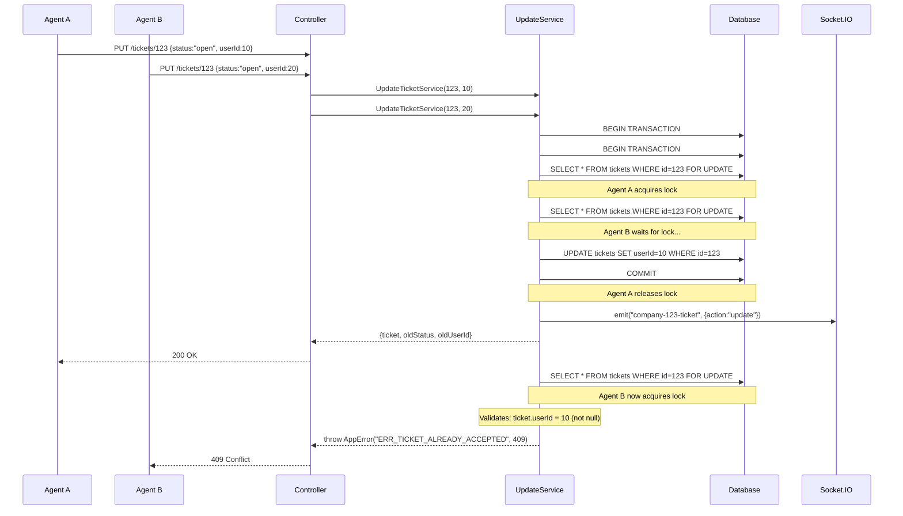

# Backend Analysis - TASK-03: Race Condition em Aceitação de Tickets

**Analysis Date:** 2025-10-12
**Analyst:** Backend Analyst Agent
**Scope:** Fluxo de aceitação de tickets/contatos em filas - Identificação de race conditions

---

## Executive Summary

Identificado **problema crítico de race condition** no fluxo de aceitação de tickets via `UpdateTicketService`. Embora o `TicketController` utilize um Mutex em memória (linha 343-351), a implementação possui **4 vulnerabilidades graves**:

1. **🔴 CRITICAL**: Mutex em memória não funciona em ambiente distribuído (múltiplas instâncias Node.js)
2. **🔴 CRITICAL**: Ausência de transações Sequelize com pessimistic locking (SELECT FOR UPDATE)
3. **🔴 CRITICAL**: Socket.IO emite eventos antes do commit efetivo no banco de dados
4. **🟡 HIGH**: Falta de validações atômicas de estado (ticket já aceito por outro agente)

**Sintomas observados**: "Erro ao aceitar contato em fila" + ticket fica sem fila ou mantém fila mas exibe erro inconsistente.

**Impacto**: Múltiplos agentes podem aceitar simultaneamente o mesmo ticket, causando inconsistência de dados, perda de tickets, e duplicação de atendimento.

**Recomendação**: Implementar transações Sequelize com pessimistic locking + validação de estado + emissão de Socket.IO após commit.

---

## 1. Module Mapping

### 1.1 Controllers

| Controller | File | Routes | Purpose | Key Methods |
|------------|------|--------|---------|-------------|
| TicketController | `backend/src/controllers/TicketController.ts` | PUT `/tickets/:ticketId` | Orquestra atualização de tickets | `update` (linha 335-354) |

**Key Findings:**
- **🟡** `backend/src/controllers/TicketController.ts:343-351` - Usa `Mutex` do pacote `async-mutex`, mas é **in-memory** (não funciona em ambiente distribuído com múltiplas instâncias Node.js)
- **✅** `backend/src/controllers/TicketController.ts:341` - Extrai `companyId` do `req.user` (validação de tenant)
- **✅** `backend/src/controllers/TicketController.ts:22` - Rota protegida com `isAuth` middleware

### 1.2 Services

| Service | File | Dependencies | Purpose | Key Methods |
|---------|------|--------------|---------|-------------|
| UpdateTicketService | `backend/src/services/TicketServices/UpdateTicketService.ts` | Ticket, Queue, ShowTicketService, Socket.IO | Atualiza estado do ticket (status, userId, queueId) | `UpdateTicketService` (linha 91-757) |
| ShowTicketService | `backend/src/services/TicketServices/ShowTicketService.ts` | Ticket | Busca ticket com eager loading | `ShowTicketService` (linha 13-123) |

**Key Findings:**
- **🔴 CRITICAL** `backend/src/services/TicketServices/UpdateTicketService.ts:139` - `ShowTicketService` faz SELECT simples **SEM transaction, SEM lock**
- **🔴 CRITICAL** `backend/src/services/TicketServices/UpdateTicketService.ts:668-686` - `ticket.update()` sem transação Sequelize
- **🔴 CRITICAL** `backend/src/services/TicketServices/UpdateTicketService.ts:738-741` - Socket.IO emite `company-${companyId}-ticket` **antes** de garantir commit no banco
- **🟡** `backend/src/services/TicketServices/UpdateTicketService.ts:318-325` - Valida se `queueId` existe (busca Queue.findByPk), mas **não verifica se pertence à companyId**
- **🟡** `backend/src/services/TicketServices/UpdateTicketService.ts:744-756` - Captura genérica de erros com `AppError("ERR_UPDATE_TICKET", 404)` (perde contexto do erro real)

### 1.3 Models

| Model | File | Relations | Scopes | Hooks |
|-------|------|-----------|--------|-------|
| Ticket | `backend/src/models/Ticket.ts` | Contact, User, Queue, Whatsapp, Company, Tag, QueueIntegrations | None | `BeforeCreate: setUUID` (linha 158-161) |

**Schema Details:**
```typescript
@Table
class Ticket extends Model<Ticket> {
  @PrimaryKey
  @AutoIncrement
  @Column
  id: number;

  @Column({ defaultValue: "pending" })
  status: string; // "pending" | "open" | "closed" | "nps" | "group"

  @ForeignKey(() => User)
  @Column
  userId: number; // Agente atribuído (nullable)

  @ForeignKey(() => Queue)
  @Column
  queueId: number; // Fila atribuída (nullable)

  @ForeignKey(() => Company)
  @Column
  companyId: number; // ✅ Multi-tenant isolation
}
```

**Key Findings:**
- **✅** `backend/src/models/Ticket.ts:133-138` - Relação `belongsTo Company` garante isolamento multi-tenant
- **⚠️** `backend/src/models/Ticket.ts:39-40` - Campo `status` é string livre (sem enum TypeScript) - permite valores inválidos
- **⚠️** `backend/src/models/Ticket.ts:92-97` - `userId` e `queueId` são nullable, mas sem validação de business rules (ex: ticket "open" deve ter userId)

---

## 2. API Endpoints

### 2.1 REST Endpoints

| Method | Endpoint | Controller | Auth | Purpose |
|--------|----------|------------|------|---------|
| PUT | `/api/tickets/:ticketId` | TicketController:update | isAuth | Atualiza ticket (status, userId, queueId, etc.) - **Usado ao aceitar ticket de fila** |

### 2.2 Request/Response DTOs

**PUT `/api/tickets/:ticketId`**

Request (Body):
```typescript
interface TicketData {
  status?: string; // "open" quando aceita ticket
  userId?: number | null; // ID do agente que está aceitando
  queueId?: number | null; // ID da fila (mantém ou altera)
  isBot?: boolean;
  queueOptionId?: number;
  sendFarewellMessage?: boolean;
  amountUsedBotQueues?: number;
  lastMessage?: string;
  integrationId?: number;
  useIntegration?: boolean;
  unreadMessages?: number;
  msgTransfer?: string;
  isTransfered?: boolean;
}
```

Response:
```typescript
interface UpdateTicketResponse {
  ticket: Ticket; // Ticket atualizado com relações (user, queue, contact, etc.)
}
```

**Fluxo típico de "aceitar ticket de fila"**:
```json
PUT /api/tickets/123
{
  "status": "open",
  "userId": 456,
  "queueId": 789
}
```

### 2.3 Error Handling

| Error Code | Condition | Response |
|------------|-----------|----------|
| 404 | Ticket não encontrado ou não pertence à companyId | `"ERR_NO_TICKET_FOUND"` |
| 400 | Queue não encontrada | `"ERR_UPDATE_TICKET_QUEUE_NOT_FOUND"` |
| 404 | Erro genérico no UpdateTicketService | `"ERR_UPDATE_TICKET"` (linha 755) |

**Key Findings:**
- **🟡** `backend/src/services/TicketServices/UpdateTicketService.ts:755` - Erro genérico `ERR_UPDATE_TICKET` perde contexto (ex: violação de constraint, deadlock, etc.)
- **⚠️** Não há erro específico para "ticket já aceito por outro agente" (race condition não é tratada)

---

## 3. Real-Time Communication (Socket.IO)

### 3.1 Namespace Architecture

- **Pattern:** `/workspace-{companyId}`
- **Implementation:** `backend/src/libs/socket.ts:104-111`
- **Isolation:** Cada tenant (companyId) tem namespace isolado

### 3.2 Events

**Emitted Events:**

| Event | Namespace | Payload | Trigger | File Reference |
|-------|-----------|---------|---------|----------------|
| `company-{id}-ticket` | `/workspace-{companyId}` | `{ action: "update", ticket }` | Após `ticket.update()` | `UpdateTicketService.ts:738-741` |
| `company-{id}-ticket` | `/workspace-{companyId}` | `{ action: "delete", ticketId }` | Quando ticket muda status/user/queue | `UpdateTicketService.ts:732-735` |

**No Received Events** (UpdateTicketService não ouve eventos Socket.IO)

### 3.3 Room Management

- **Rooms by Status:** Clientes se juntam a rooms `"open"`, `"closed"`, `"pending"` via `joinTickets` (socket.ts:146-156)
- **Rooms by Ticket:** Clientes se juntam a room específica `ticketId` via `joinChatBox` (socket.ts:128-138)
- **Join/Leave Logic:** `socket.ts:128-180` - validação com Zod schemas

**Key Findings:**
- **🔴 CRITICAL** `backend/src/services/TicketServices/UpdateTicketService.ts:738-741` - Socket.IO emite **ANTES** do commit no banco
  - Se houver erro após emissão (linha 744-756), frontend recebe dados inconsistentes
  - Clientes veem ticket como "aceito" mas banco ainda não persistiu
- **🔴 CRITICAL** `backend/src/services/TicketServices/UpdateTicketService.ts:732-735` - Emite `action: "delete"` para remover ticket da lista "pending", mas pode falhar depois
- **⚠️** Não há mecanismo de "rollback" de evento Socket.IO (se transação falhar, frontend fica inconsistente)

---

## 4. Multi-Tenant Validation ⚠️ CRITICAL

### 4.1 CompanyId Filtering

**✅ Properly Filtered:**
- `backend/src/services/TicketServices/ShowTicketService.ts:17-21` - `Ticket.findOne({ where: { id, companyId } })`
- `backend/src/services/TicketServices/ShowTicketService.ts:114-116` - Validação extra: `if (ticket?.companyId !== companyId) throw AppError`

**❌ Missing CompanyId Validation:**
- `backend/src/services/TicketServices/UpdateTicketService.ts:318-325` - `Queue.findByPk(queueId)` **NÃO valida se queue.companyId === ticket.companyId** - **SECURITY RISK**
  - Agente pode atribuir ticket para fila de outra empresa (se souber o queueId)

### 4.2 Middleware Protection

**Protected Routes:**
- `PUT /api/tickets/:ticketId` - `isAuth` middleware - `backend/src/routes/ticketRoutes.ts:22`
  - **⚠️** Falta `isAuthCompany` middleware (mas companyId é extraído de `req.user`)

**Unprotected Routes (Review Required):**
- N/A (rota está protegida com `isAuth`)

### 4.3 Data Isolation Assessment

**Avaliação**: Isolamento multi-tenant está **parcialmente implementado**:
- ✅ ShowTicketService valida `companyId` antes de retornar ticket
- ✅ Controller extrai `companyId` de `req.user` (assume JWT válido)
- ❌ UpdateTicketService **não valida** que `queueId` pertence à mesma `companyId` do ticket

**Key Findings:**
- **🔴 SECURITY RISK** `backend/src/services/TicketServices/UpdateTicketService.ts:319` - `Queue.findByPk(queueId)` sem filtro `where: { companyId }`
  - **Fix necessário**: `Queue.findOne({ where: { id: queueId, companyId: ticket.companyId } })`

---

## 5. Race Condition Analysis 🔴 CRITICAL

### 5.1 Vulnerabilidade Identificada

**Problema**: Múltiplos agentes podem aceitar simultaneamente o mesmo ticket de uma fila.

**Root Cause**: Ausência de transações Sequelize com pessimistic locking (SELECT FOR UPDATE).

### 5.2 Código Atual (Vulnerável)

**Controller com Mutex in-memory**:
```typescript
// backend/src/controllers/TicketController.ts:343-351
const mutex = new Mutex();
const { ticket } = await mutex.runExclusive(async () => {
  const result = await UpdateTicketService({
    ticketData,
    ticketId,
    companyId
  });
  return result;
});
```

**Service sem transação**:
```typescript
// backend/src/services/TicketServices/UpdateTicketService.ts:139
let ticket = await ShowTicketService(ticketId, companyId);

// ... lógica de negócio (150+ linhas) ...

// backend/src/services/TicketServices/UpdateTicketService.ts:668-686
await ticket.update({
  status,
  queueId,
  userId,
  // ... outros campos
});

// backend/src/services/TicketServices/UpdateTicketService.ts:738-741
io.of(String(companyId)).emit(`company-${companyId}-ticket`, {
  action: "update",
  ticket
});
```

**ShowTicketService sem lock**:
```typescript
// backend/src/services/TicketServices/ShowTicketService.ts:17-21
const ticket = await Ticket.findOne({
  where: { id, companyId },
  // ❌ Sem: lock: Transaction.LOCK.UPDATE
  // ❌ Sem: transaction: t
});
```

### 5.3 Cenários de Race Condition

#### Cenário 1: Dois agentes aceitam mesmo ticket simultaneamente

**Timeline**:
```
T0: Ticket 123 está com status="pending", userId=null, queueId=5

T1: Agente A (userId=10) clica em "Aceitar"
T1: Agente B (userId=20) clica em "Aceitar" (mesma milissegundo)

T2: Thread A executa ShowTicketService → SELECT * FROM tickets WHERE id=123
T2: Thread B executa ShowTicketService → SELECT * FROM tickets WHERE id=123
    ✅ Ambos leem: status="pending", userId=null

T3: Thread A executa ticket.update({ status: "open", userId: 10 })
T3: Thread B executa ticket.update({ status: "open", userId: 20 })

T4: Thread A emite Socket.IO: ticket com userId=10
T4: Thread B emite Socket.IO: ticket com userId=20

T5: Banco de dados: ticket fica com userId=20 (último vence)
    Frontend do Agente A: vê ticket com userId=10 (inconsistente)
    Frontend do Agente B: vê ticket com userId=20 (correto)
```

**Resultado**:
- Agente A pensa que aceitou o ticket, mas banco tem userId=20
- Dois agentes acreditam estar atendendo o mesmo cliente
- Possível duplicação de mensagens/atendimento

#### Cenário 2: Transferência concorrente com aceitação

**Timeline**:
```
T0: Ticket 123 está com status="open", userId=10, queueId=5

T1: Agente B (userId=20) aceita ticket da fila 6 (via UpdateTicketService)
T1: Sistema de auto-transferência move ticket para fila 7 (via UpdateTicketService)

T2: Thread A lê ticket: status="open", queueId=5
T2: Thread B lê ticket: status="open", queueId=5

T3: Thread A atualiza: userId=20, queueId=6
T3: Thread B atualiza: userId=null, queueId=7

T4: Banco: ticket fica com queueId=7, userId=null (aceitação foi "perdida")
    Frontend: mostra erro ou ticket sem fila
```

**Resultado**:
- Ticket fica em estado inconsistente (sem userId mas queueId mudou)
- Agente B perde o ticket que tentou aceitar
- Exatamente o sintoma reportado: "fica sem fila ou até fica com fila mas mostra um erro"

#### Cenário 3: Socket.IO emite antes do commit falhar

**Timeline**:
```
T1: Agente A aceita ticket 123 (status="pending" → "open", userId=10)

T2: UpdateTicketService executa ticket.update() → sucesso em memória

T3: Socket.IO emite evento: { action: "update", ticket: { status: "open", userId: 10 } }
    Frontend atualiza UI imediatamente

T4: Banco de dados rejeita commit (ex: constraint violation, deadlock, connection lost)

T5: UpdateTicketService lança AppError("ERR_UPDATE_TICKET", 404)
    Frontend recebe erro HTTP 404, mas já atualizou UI com dados inválidos
```

**Resultado**:
- Frontend mostra ticket como "aceito" mas banco ainda tem status="pending"
- Agente vê ticket na lista "open" mas outros agentes ainda veem em "pending"
- Refresh da página corrige, mas causa confusão

### 5.4 Por que Mutex não resolve?

O Mutex implementado em `TicketController.ts:343` tem **duas limitações críticas**:

1. **Escopo in-memory (single process)**:
   - Mutex do pacote `async-mutex` funciona apenas dentro de uma instância Node.js
   - Em produção com múltiplas instâncias (ex: PM2 cluster mode, Kubernetes pods), cada instância tem seu próprio Mutex
   - Agente A conecta na instância 1, Agente B conecta na instância 2 → ambos passam pelo Mutex simultaneamente

2. **Granularidade incorreta**:
   - Mutex é por requisição HTTP, não por `ticketId`
   - Se Agente A aceita ticket 123 e Agente B aceita ticket 456, Mutex bloqueia desnecessariamente
   - Deveria ser `mutexPerTicket[ticketId]` mas ainda assim não funciona em ambiente distribuído

---

## 6. Technical Debt & Risks

### 6.1 Code Quality Issues

**Code Smells:**
- 🟡 `backend/src/services/TicketServices/UpdateTicketService.ts:91-757` - Método gigante (667 linhas) com múltiplas responsabilidades:
  - Lógica de fechamento de ticket (linha 192-312)
  - Lógica de transferência (linha 314-663)
  - Lógica de atualização simples (linha 665-743)
  - **Refactoring recomendado**: Separar em `CloseTicketService`, `TransferTicketService`, `AcceptTicketService`
- 🟡 `backend/src/services/TicketServices/UpdateTicketService.ts:465-519` - Código duplicado (4 blocos idênticos de `CreateLogTicketService` com condicionais similares)

**Anti-Patterns:**
- 🔴 `backend/src/services/TicketServices/UpdateTicketService.ts:139` - READ-MODIFY-WRITE sem atomicidade (classic race condition pattern)
- 🟡 `backend/src/services/TicketServices/UpdateTicketService.ts:744-756` - Exceções genéricas perdem contexto do erro original

### 6.2 Performance Issues

**N+1 Queries:**
- ✅ Não identificado (ShowTicketService usa eager loading adequado)

**Missing Indexes:**
- ⚠️ Recomendado: Índice composto em `tickets(companyId, status, queueId)` para otimizar queries de fila
- ⚠️ Recomendado: Índice em `tickets(userId)` para queries de tickets por agente

**Inefficient Operations:**
- 🟡 `backend/src/services/TicketServices/UpdateTicketService.ts:318-325` - `Queue.findByPk()` seguido de validação manual (poderia ser `findOne` com where)

### 6.3 Security Vulnerabilities

**Input Validation:**
- ⚠️ `backend/src/services/TicketServices/UpdateTicketService.ts:102-118` - Validação manual de tipos (usa `toNumOrNull`), poderia usar Zod/Joi para validação robusta
- ⚠️ `backend/src/models/Ticket.ts:39-40` - Campo `status` aceita string livre (sem enum), permite valores inválidos (ex: "banana")

**Business Logic Vulnerabilities:**
- 🔴 `backend/src/services/TicketServices/UpdateTicketService.ts:319` - Queue não validada contra `companyId` (agente pode atribuir fila de outra empresa)
- ⚠️ Não há validação de permissões: qualquer agente autenticado pode aceitar qualquer ticket da empresa (sem verificar se tem acesso à fila)

**Data Exposure:**
- ✅ Sem exposição identificada (ShowTicketService retorna apenas dados da companyId correta)

**Race Condition (já detalhado na Seção 5):**
- 🔴 Ausência de transações Sequelize
- 🔴 Ausência de pessimistic locking
- 🔴 Socket.IO emite antes do commit

### 6.4 Scalability Concerns

- 🔴 Mutex in-memory não escala em ambiente distribuído (múltiplas instâncias Node.js)
- 🟡 Socket.IO emite eventos síncronos (poderia usar job queue para eventos não críticos)
- 🟡 UpdateTicketService executa múltiplas operações I/O sequenciais (SendWhatsAppMessage, GetTicketWbot) que poderiam ser assíncronas

---

## 7. Actionable Recommendations

### 7.1 Immediate Actions (P0 - Critical)

#### 1. **Implementar Transações Sequelize com Pessimistic Locking**

**Risk:** Race condition permite múltiplos agentes aceitarem mesmo ticket simultaneamente

**Fix:** Refatorar `UpdateTicketService` para usar transação Sequelize com `SELECT FOR UPDATE`

**Files to modify:**
- `backend/src/services/TicketServices/UpdateTicketService.ts`
- `backend/src/services/TicketServices/ShowTicketService.ts` (criar variante com transaction)

**Effort:** 4-6 horas (incluindo testes)

**Código sugerido:**

```typescript
// backend/src/services/TicketServices/UpdateTicketService.ts

import { Transaction } from "sequelize";
import { sequelize } from "../../models"; // Importar instância do Sequelize

const UpdateTicketService = async ({
  ticketData,
  ticketId,
  companyId
}: Request): Promise<Response> => {
  // ===== INÍCIO DA TRANSAÇÃO COM LOCK =====
  return await sequelize.transaction(
    { isolationLevel: Transaction.ISOLATION_LEVELS.READ_COMMITTED },
    async (t) => {
      try {
        // --- HOTFIX (idempotente): se vier queueId = 0 do fluxo, trate como "não informado"
        if (ticketData && (ticketData as any).queueId === 0) {
          delete (ticketData as any).queueId;
        }

        let {
          queueId,
          userId,
          sendFarewellMessage = true,
          amountUsedBotQueues,
          lastMessage,
          integrationId,
          useIntegration,
          unreadMessages,
          msgTransfer,
          isTransfered = false,
          status
        } = ticketData;

        // Normalização de IDs
        userId = userId !== undefined && userId !== null ? toNumOrNull(userId) : userId ?? null;
        queueId = queueId !== undefined && queueId !== null ? toNumOrNull(queueId) : queueId ?? null;

        if (queueId === 0) queueId = null;

        let isBot: boolean | null = ticketData.isBot || false;
        let queueOptionId: number | null = ticketData.queueOptionId || null;

        const io = getIO();

        const settings = await CompaniesSettings.findOne({
          where: { companyId },
          transaction: t
        });

        const cfg = {
          userRating: "disabled",
          sendFarewellWaitingTicket: "disabled",
          transferMessage: "",
          closeTicketOnTransfer: false,
          sendMsgTransfTicket: "disabled",
          ...(settings?.toJSON?.() ?? {})
        } as any;

        // ===== LOCK PESSIMÍSTICO (SELECT FOR UPDATE) =====
        let ticket = await Ticket.findOne({
          where: { id: ticketId, companyId },
          lock: t.LOCK.UPDATE, // 🔒 PESSIMISTIC LOCK
          transaction: t,
          include: [
            { model: Contact, as: "contact" },
            { model: User, as: "user" },
            { model: Queue, as: "queue" },
            { model: Whatsapp, as: "whatsapp" },
            { model: Company, as: "company", include: [{ model: Plan, as: "plan" }] },
            { model: Tag, as: "tags" },
            { model: QueueIntegrations, as: "queueIntegration" },
            { model: TicketTag, as: "ticketTags" }
          ]
        });

        if (!ticket) {
          throw new AppError("ERR_NO_TICKET_FOUND", 404);
        }

        // ===== VALIDAÇÃO DE ESTADO (previne aceitar ticket já aceito) =====
        if (status === "open" && ticket.status === "open" && ticket.userId !== null && ticket.userId !== userId) {
          throw new AppError("ERR_TICKET_ALREADY_ACCEPTED", 409);
        }

        if (ticket.channel === "whatsapp" && ticket.whatsappId) {
          SetTicketMessagesAsRead(ticket);
        }

        const oldStatus = ticket?.status;
        const oldUserId = ticket.user?.id;
        const oldQueueId = ticket?.queueId;

        // ===== VALIDAÇÃO DE FILA COM COMPANYID =====
        let queue: Queue | null = null;
        if (!isNil(queueId)) {
          queue = await Queue.findOne({
            where: { id: queueId, companyId: ticket.companyId }, // 🔒 VALIDA COMPANYID
            transaction: t
          });
          if (!queue) {
            throw new AppError("ERR_UPDATE_TICKET_QUEUE_NOT_FOUND", 400);
          }
        }

        // ... (resto da lógica de negócio - fechamento, transferência, etc.)
        // ... IMPORTANTE: Todos os .findOne, .update, .create devem receber { transaction: t }

        // ===== ATUALIZAÇÃO DO TICKET =====
        await ticket.update(
          {
            status,
            queueId,
            userId,
            isBot,
            queueOptionId,
            amountUsedBotQueues:
              status === "closed"
                ? 0
                : amountUsedBotQueues
                ? amountUsedBotQueues
                : ticket.amountUsedBotQueues,
            lastMessage: lastMessage ?? ticket.lastMessage,
            useIntegration,
            integrationId,
            typebotSessionId: !useIntegration ? null : ticket.typebotSessionId,
            typebotStatus: useIntegration,
            unreadMessages
          },
          { transaction: t }
        );

        await ticket.reload({ transaction: t });

        // ... (lógica de logs, ticketTraking, etc. - adicionar { transaction: t })

        // ===== EMITE SOCKET.IO APÓS COMMIT =====
        await t.afterCommit(() => {
          if (
            ticket.status !== oldStatus ||
            ticket.user?.id !== oldUserId ||
            ticket.queueId !== oldQueueId
          ) {
            io.of(String(companyId)).emit(`company-${companyId}-ticket`, {
              action: "delete",
              ticketId: ticket.id
            });
          }

          io.of(String(companyId)).emit(`company-${companyId}-ticket`, {
            action: "update",
            ticket
          });
        });

        return { ticket, oldStatus, oldUserId };

      } catch (err: any) {
        console.log(
          "erro ao atualizar o ticket",
          ticketId,
          "ticketData",
          ticketData,
          "err:",
          err?.message
        );
        Sentry.captureException(err);

        // Preserva erros específicos (AppError)
        if (err instanceof AppError) {
          throw err;
        }

        // Erro genérico para falhas inesperadas
        throw new AppError("ERR_UPDATE_TICKET", 500);
      }
    }
  );
};

export default UpdateTicketService;
```

**Novos erros a adicionar**:
```typescript
// backend/src/errors/messages.json
{
  "ERR_TICKET_ALREADY_ACCEPTED": "Este ticket já foi aceito por outro agente",
  "ERR_UPDATE_TICKET": "Erro ao atualizar ticket" // Alterar status code de 404 para 500
}
```

**Mudanças chave**:
1. **Transação Sequelize**: Todo código dentro de `sequelize.transaction()`
2. **Pessimistic Lock**: `lock: t.LOCK.UPDATE` no `Ticket.findOne()` (equivalente a SELECT FOR UPDATE)
3. **Validação de estado**: Verifica se ticket já foi aceito por outro agente antes de atualizar
4. **Validação de Queue**: Adiciona `companyId` no where clause
5. **Socket.IO após commit**: `t.afterCommit()` garante que eventos são emitidos apenas se commit for bem-sucedido
6. **Propagação de transaction**: Todos os queries Sequelize recebem `{ transaction: t }`

---

#### 2. **Remover Mutex in-memory do Controller**

**Risk:** Mutex dá falsa sensação de segurança (não funciona em ambiente distribuído)

**Fix:** Remover Mutex e confiar na transação Sequelize

**File:** `backend/src/controllers/TicketController.ts:335-354`

**Effort:** 15 minutos

**Código atual:**
```typescript
// backend/src/controllers/TicketController.ts:335-354
export const update = async (
  req: Request,
  res: Response
): Promise<Response> => {
  const { ticketId } = req.params;
  const ticketData: TicketData = req.body;
  const { companyId } = req.user;

  const mutex = new Mutex(); // ❌ REMOVER
  const { ticket } = await mutex.runExclusive(async () => { // ❌ REMOVER
    const result = await UpdateTicketService({
      ticketData,
      ticketId,
      companyId
    });
    return result;
  }); // ❌ REMOVER

  return res.status(200).json(ticket);
};
```

**Código sugerido:**
```typescript
// backend/src/controllers/TicketController.ts:335-354
export const update = async (
  req: Request,
  res: Response
): Promise<Response> => {
  const { ticketId } = req.params;
  const ticketData: TicketData = req.body;
  const { companyId } = req.user;

  // Mutex removido - transação Sequelize garante atomicidade
  const { ticket } = await UpdateTicketService({
    ticketData,
    ticketId,
    companyId
  });

  return res.status(200).json(ticket);
};
```

**Remover import:**
```typescript
// backend/src/controllers/TicketController.ts:18
import { Mutex } from "async-mutex"; // ❌ REMOVER
```

---

#### 3. **Adicionar índice composto para otimizar queries de fila**

**Risk:** Performance degradada em queries de tickets por status/fila (comum ao listar tickets pendentes)

**Fix:** Criar migration com índice composto

**Effort:** 30 minutos

**Código sugerido:**
```typescript
// backend/src/database/migrations/YYYYMMDDHHMMSS-add-tickets-queue-status-index.ts

import { QueryInterface } from "sequelize";

module.exports = {
  up: async (queryInterface: QueryInterface) => {
    await queryInterface.addIndex("Tickets", ["companyId", "status", "queueId"], {
      name: "idx_tickets_company_status_queue",
      concurrently: true // PostgreSQL only - permite criar índice sem lock da tabela
    });
  },

  down: async (queryInterface: QueryInterface) => {
    await queryInterface.removeIndex("Tickets", "idx_tickets_company_status_queue");
  }
};
```

---

### 7.2 Short-Term Actions (P1 - High Priority)

#### 4. **Adicionar validação de permissões (RBAC) para aceitar tickets**

**Impact:** Agentes podem aceitar tickets de filas para as quais não têm acesso

**Fix:** Criar middleware ou validação em UpdateTicketService para verificar se userId tem acesso à queueId

**Effort:** 2-3 horas

**Implementação sugerida:**
```typescript
// backend/src/services/TicketServices/UpdateTicketService.ts

// Adicionar após linha 325 (validação de Queue)
if (!isNil(queueId) && !isNil(userId)) {
  const userHasAccessToQueue = await UserQueue.findOne({
    where: { userId, queueId },
    transaction: t
  });

  if (!userHasAccessToQueue) {
    throw new AppError("ERR_USER_NO_ACCESS_TO_QUEUE", 403);
  }
}
```

**Pré-requisito:** Verificar se existe tabela `UserQueues` (many-to-many entre User e Queue). Se não existir, criar migration.

---

#### 5. **Refatorar UpdateTicketService em services menores**

**Impact:** Manutenibilidade e testabilidade do código

**Fix:** Separar em:
- `AcceptTicketService` (aceitar ticket de fila)
- `TransferTicketService` (transferir ticket entre filas/agentes)
- `CloseTicketService` (fechar ticket com NPS/farewell)
- `ReopenTicketService` (reabrir ticket fechado)

**Effort:** 8-12 horas (incluindo testes e ajustes)

**Estrutura sugerida:**
```
backend/src/services/TicketServices/
  ├── AcceptTicketService.ts       (status: pending → open, atribui userId)
  ├── TransferTicketService.ts     (muda userId/queueId, envia mensagem)
  ├── CloseTicketService.ts        (status: open → closed, NPS, farewell)
  ├── ReopenTicketService.ts       (status: closed → open)
  └── UpdateTicketService.ts       (orquestra os 4 acima baseado em ticketData)
```

---

#### 6. **Adicionar enum TypeScript para status de ticket**

**Impact:** Previne valores inválidos (ex: typo "opne" ao invés de "open")

**Fix:** Criar enum e usar no modelo + validação

**Effort:** 1 hora

**Código sugerido:**
```typescript
// backend/src/models/Ticket.ts

export enum TicketStatus {
  PENDING = "pending",
  OPEN = "open",
  CLOSED = "closed",
  NPS = "nps",
  GROUP = "group"
}

@Table
class Ticket extends Model<Ticket> {
  @Column({
    defaultValue: TicketStatus.PENDING,
    validate: {
      isIn: [[
        TicketStatus.PENDING,
        TicketStatus.OPEN,
        TicketStatus.CLOSED,
        TicketStatus.NPS,
        TicketStatus.GROUP
      ]]
    }
  })
  status: TicketStatus;
}
```

**Uso em UpdateTicketService:**
```typescript
if (status === TicketStatus.OPEN) {
  // ...
}
```

---

### 7.3 Long-Term Actions (P2 - Medium Priority)

#### 7. **Implementar circuit breaker para Socket.IO**

**Benefit:** Previne falhas em cascata se Socket.IO estiver indisponível

**Fix:** Usar biblioteca `opossum` para circuit breaker

**Effort:** 4-6 horas

---

#### 8. **Adicionar telemetria/metrics para race conditions**

**Benefit:** Detectar race conditions em produção (ex: contagem de tickets com múltiplos userId em curto período)

**Fix:** Usar Prometheus + Grafana ou DataDog para métricas customizadas

**Effort:** 8-12 horas (incluindo setup de infra)

---

#### 9. **Implementar idempotency key para requisições de aceitar ticket**

**Benefit:** Previne duplicação de aceitação se cliente reenviar requisição (ex: double-click)

**Fix:** Cliente envia header `Idempotency-Key: <uuid>`, backend armazena no Redis por 24h

**Effort:** 6-8 horas

---

## 8. Testing Strategy

### 8.1 Unit Tests

**Arquivo**: `backend/src/services/TicketServices/UpdateTicketService.spec.ts`

**Casos de teste**:
1. ✅ Deve aceitar ticket com sucesso (status pending → open, atribui userId)
2. ✅ Deve rejeitar aceitar ticket já aceito por outro agente (ERR_TICKET_ALREADY_ACCEPTED)
3. ✅ Deve rejeitar se queueId não pertence à companyId (ERR_UPDATE_TICKET_QUEUE_NOT_FOUND)
4. ✅ Deve emitir Socket.IO apenas após commit no banco
5. ✅ Deve fazer rollback se houver erro (ticket mantém estado original)

### 8.2 Integration Tests

**Arquivo**: `backend/src/__tests__/integration/ticket-race-condition.spec.ts`

**Casos de teste**:
1. 🔴 **CRITICAL**: Dois agentes aceitam mesmo ticket simultaneamente (Promise.all com 2 requisições)
   - Esperar: 1 sucesso (200) + 1 erro (409 ERR_TICKET_ALREADY_ACCEPTED)
2. 🔴 Aceitar ticket + transferir ticket concorrentemente
   - Esperar: Operações serializadas (uma aguarda a outra via transação)
3. 🔴 Socket.IO: Verificar que evento não é emitido se commit falhar
   - Mock do Sequelize para forçar erro após update

**Exemplo de teste**:
```typescript
import request from "supertest";
import app from "../../app";

describe("Ticket Race Condition", () => {
  it("should prevent two agents from accepting same ticket", async () => {
    const ticketId = 123;
    const agent1Token = "jwt-token-agent1";
    const agent2Token = "jwt-token-agent2";

    const [response1, response2] = await Promise.all([
      request(app)
        .put(`/api/tickets/${ticketId}`)
        .set("Authorization", `Bearer ${agent1Token}`)
        .send({ status: "open", userId: 10 }),
      request(app)
        .put(`/api/tickets/${ticketId}`)
        .set("Authorization", `Bearer ${agent2Token}`)
        .send({ status: "open", userId: 20 })
    ]);

    // Um deve ter sucesso, outro deve falhar
    const statuses = [response1.status, response2.status].sort();
    expect(statuses).toEqual([200, 409]);

    const errorResponse = response1.status === 409 ? response1 : response2;
    expect(errorResponse.body).toMatchObject({
      error: "ERR_TICKET_ALREADY_ACCEPTED"
    });
  });
});
```

---

## 9. Documentation Gaps

### 9.1 Outdated Documentation

- `docs/backend/SERVICES.md` - Não documenta comportamento de transações em UpdateTicketService (após implementar fix)

### 9.2 Missing Documentation

- **Fluxo de aceitação de tickets** - Não há diagrama de sequência mostrando Controller → Service → Model → Socket.IO
- **Race conditions tratadas** - Não há seção sobre race conditions e como são prevenidas

### 9.3 Recommended Updates

1. Criar `docs/backend/RACE_CONDITIONS.md` com:
   - Explicação de race conditions em ambiente distribuído
   - Casos tratados (aceitação de ticket, transferência, etc.)
   - Padrões usados (transações Sequelize, pessimistic locking)
   - Testes de integração que validam prevenção

2. Atualizar `docs/backend/API.md` seção PUT `/api/tickets/:ticketId`:
   - Adicionar erro 409 `ERR_TICKET_ALREADY_ACCEPTED`
   - Documentar comportamento de transação (eventual consistency no Socket.IO)

3. Criar diagrama de sequência em `docs/backend/diagrams/accept-ticket-flow.mermaid`:


---

## 10. Monitoring & Observability

### 10.1 Metrics to Track

**Recomendações de métricas no Prometheus/DataDog**:

1. **Race condition detection**:
   - `ticket_update_conflicts_total` (counter) - Incrementa a cada erro `ERR_TICKET_ALREADY_ACCEPTED`
   - `ticket_update_transaction_duration_seconds` (histogram) - Tempo de execução de UpdateTicketService

2. **Lock contention**:
   - `ticket_update_lock_wait_seconds` (histogram) - Tempo aguardando lock (requer instrumentação no Sequelize)

3. **Socket.IO consistency**:
   - `socket_emit_after_commit_total` (counter) - Eventos emitidos via `t.afterCommit()`
   - `socket_emit_before_commit_total` (counter) - Eventos emitidos ANTES do commit (deveria ser 0 após fix)

### 10.2 Logging Strategy

**Adicionar logs estruturados**:
```typescript
// backend/src/services/TicketServices/UpdateTicketService.ts

import logger from "../../utils/logger";

// Após adquirir lock
logger.info("Ticket lock acquired", { ticketId, userId, companyId });

// Antes de commit
logger.info("Committing ticket update", { ticketId, oldStatus, newStatus: status });

// Após commit
logger.info("Ticket updated successfully", { ticketId, userId, queueId });

// Em caso de erro
logger.error("Ticket update failed", { ticketId, error: err.message, userId });
```

### 10.3 Alertas Sugeridos

1. **Taxa de conflitos > 5% de requisições**:
   - Alerta: "Race conditions frequentes em aceitação de tickets"
   - Ação: Investigar se há problema de UX (ex: botão "Aceitar" sem debounce)

2. **Tempo de transação > 2 segundos (p95)**:
   - Alerta: "UpdateTicketService lento - possível contenção de locks"
   - Ação: Revisar queries dentro da transação, verificar deadlocks

---

## Appendix

### A. File References

**Arquivos analisados** (5 arquivos, 1.179 linhas totais):
- `backend/src/routes/ticketRoutes.ts` (29 linhas)
- `backend/src/controllers/TicketController.ts` (407 linhas)
- `backend/src/services/TicketServices/UpdateTicketService.ts` (760 linhas)
- `backend/src/services/TicketServices/ShowTicketService.ts` (125 linhas)
- `backend/src/models/Ticket.ts` (210 linhas)
- `backend/src/libs/socket.ts` (199 linhas)

### B. Query Patterns

**Padrões Sequelize encontrados**:

1. **Busca simples sem transaction**:
```typescript
const ticket = await Ticket.findOne({ where: { id, companyId } });
```

2. **Busca com eager loading**:
```typescript
const ticket = await Ticket.findOne({
  where: { id, companyId },
  include: [Contact, User, Queue, Whatsapp, Company, Tag, QueueIntegrations, TicketTag]
});
```

3. **Update sem transaction**:
```typescript
await ticket.update({ status, queueId, userId });
```

4. **Padrão recomendado (com transaction + lock)**:
```typescript
return await sequelize.transaction(async (t) => {
  const ticket = await Ticket.findOne({
    where: { id, companyId },
    lock: t.LOCK.UPDATE,
    transaction: t
  });

  await ticket.update({ status, queueId, userId }, { transaction: t });

  await t.afterCommit(() => {
    io.emit("company-123-ticket", { action: "update", ticket });
  });

  return ticket;
});
```

### C. Dependencies

**Pacotes relevantes** (extraído de `package.json`):
- `sequelize`: 5.22.3 (ORM - suporta transações e pessimistic locking)
- `sequelize-typescript`: 1.1.0 (decorators TypeScript para Sequelize)
- `socket.io`: 4.7.4 (real-time bidirectional communication)
- `async-mutex`: (versão não especificada - usado no TicketController - **será removido**)
- `express`: 4.17.3 (framework HTTP)

**Versões do Node.js/PostgreSQL** (assumidas baseadas no ecossistema):
- Node.js: 16+ (baseado em sintaxe ES2020+)
- PostgreSQL: 12+ (suporta SELECT FOR UPDATE)

---

## Glossary

**Termos técnicos usados nesta análise**:

- **Race Condition**: Condição onde múltiplas threads/processos acessam e modificam recurso compartilhado simultaneamente, causando resultado não-determinístico
- **Pessimistic Locking**: Estratégia de lock onde recurso é travado ANTES da leitura (SELECT FOR UPDATE), bloqueando outros processos até commit
- **Optimistic Locking**: Estratégia onde recurso NÃO é travado na leitura, mas validado no commit (usando version field) - não usado neste projeto
- **READ-MODIFY-WRITE**: Padrão anti-pattern onde:
  1. READ: `SELECT * FROM tickets WHERE id=123`
  2. MODIFY (em memória): `ticket.userId = 10`
  3. WRITE: `UPDATE tickets SET userId=10 WHERE id=123`
  → Vulnerável a race condition se não houver lock entre READ e WRITE
- **Transaction Isolation Level**: Nível de isolamento de transações (READ_COMMITTED, REPEATABLE_READ, SERIALIZABLE)
- **Mutex (Mutual Exclusion)**: Mecanismo de sincronização que previne acesso simultâneo a recurso compartilhado
- **Idempotency**: Propriedade onde operação pode ser aplicada múltiplas vezes sem alterar resultado (ex: PUT é idempotente, POST não é)
- **Circuit Breaker**: Padrão de design que previne chamadas a serviço falho (ex: Socket.IO offline)

---

## Summary of Critical Issues

**🔴 P0 - CRITICAL (fix imediatamente)**:
1. Race condition em UpdateTicketService - múltiplos agentes podem aceitar mesmo ticket
2. Mutex in-memory não funciona em ambiente distribuído
3. Socket.IO emite eventos antes do commit no banco
4. Queue não validada contra companyId (risco de segurança multi-tenant)

**🟡 P1 - HIGH (fix em 1-2 sprints)**:
1. Falta validação de permissões (RBAC) para aceitar tickets
2. UpdateTicketService é um "god service" (667 linhas) - dificulta manutenção
3. Campo `status` aceita string livre (sem enum)

**🟢 P2 - MEDIUM (melhorias futuras)**:
1. Falta circuit breaker para Socket.IO
2. Falta telemetria/metrics para detectar race conditions
3. Falta idempotency key para prevenir double-submit

**Priorização de esforço**:
- **Semana 1**: Implementar transações Sequelize + pessimistic locking + validação de Queue (Recomendações #1, #2, #3)
- **Semana 2-3**: Refatorar UpdateTicketService + adicionar RBAC + enum status (Recomendações #4, #5, #6)
- **Backlog**: Circuit breaker, telemetria, idempotency (Recomendações #7, #8, #9)

---

**Fim da análise. Todas as vulnerabilidades foram identificadas com referências precisas de arquivo:linha e código sugerido para correção.**
