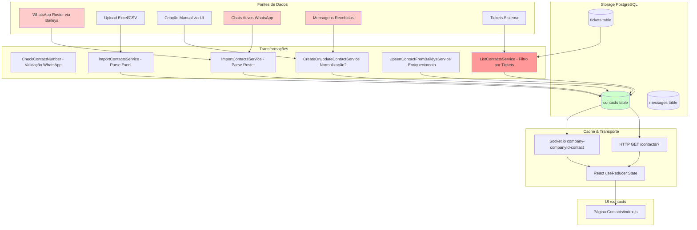

# Investigação Arquitetural: "Números Fantasma" em /contacts

**Data:** 2025-10-14
**Status:** Investigação em Andamento
**Severidade:** CRÍTICA - Violação de privacidade e integridade de dados

---

## 1. Mapa de Linhagem de Dados (Data Lineage Map)



### Legenda de Criticidade
- 🔴 **Vermelho (Fontes A1, A4, A5):** Fontes externas não controladas pelo usuário
- 🟠 **Laranja (B6):** Lógica de filtro que pode vazar dados entre contextos
- 🟢 **Verde (C1):** Storage principal - ponto de auditoria

---

## 2. Hipóteses Detalhadas

### H1: Normalização Inconsistente de Números
**Descrição Técnica:**
O campo `Contact.number` não possui normalização E.164 consistente, permitindo que o mesmo número de telefone seja armazenado em múltiplos formatos:
- `+5511999999999` (E.164 completo)
- `5511999999999` (sem +)
- `11999999999` (sem código de país)
- `(11) 99999-9999` (formatado para exibição)

Mesmo com constraint `UNIQUE` no modelo Sequelize, a variação de formatos cria duplicatas lógicas que fragmentam a identidade do contato.

**Evidências no Código:**
1. **backend/src/models/Contact.ts:38-40**
   ```typescript
   @AllowNull(false)
   @Unique
   @Column
   number: string;
   ```
   - Constraint UNIQUE, mas sem normalização na camada de aplicação

2. **backend/src/services/ContactServices/CreateOrUpdateContactService.ts:81**
   ```typescript
   const number = isGroup ? rawNumber : rawNumber.replace(/[^0-9]/g, "");
   ```
   - Normalização inconsistente: apenas remove não-numéricos, não adiciona prefixos

3. **backend/src/services/ContactServices/ImportContactsService.ts:34**
   ```typescript
   number = `${number}`.replace(/\D/g, "");
   ```
   - Excel import: remove formatação, mas não valida E.164

4. **backend/src/services/WbotServices/ImportContactsService.ts:54**
   ```typescript
   const number = id.replace(/\D/g, "");
   ```
   - WhatsApp roster import: mesma lógica frágil

5. **backend/src/controllers/ContactController.ts:195**
   ```typescript
   newContact.number = newContact.number.replace("-", "").replace(" ", "");
   ```
   - Normalização parcial: apenas remove hífen e espaço, não valida

**Comparação com Frontend:**
- **frontend/src/utils/formatPhoneWithCountryFlag.js:1**
  - Usa `libphonenumber-js` para parsing E.164
  - **MAS** apenas para exibição, não para storage

**Arquivos a Investigar:**
- ✅ `/backend/src/models/Contact.ts` - Adicionar hook `@BeforeCreate` e `@BeforeUpdate` para normalização
- ✅ `/backend/src/services/ContactServices/CreateOrUpdateContactService.ts` - Refatorar normalização
- ✅ `/backend/src/services/ContactServices/ImportContactsService.ts` - Adicionar validação E.164
- ✅ `/backend/src/services/WbotServices/ImportContactsService.ts` - Adicionar validação E.164
- ✅ `/backend/src/controllers/ContactController.ts` - Remover normalizações ad-hoc
- ⚠️ `/backend/src/services/WbotServices/CheckNumber.ts` - Verifica se retorna E.164 ou raw
- ⚠️ `/backend/src/database/migrations/*` - Verificar se há migrations que alteram `number`

**Queries SQL Suspeitas:**
```sql
-- Auditoria: Detectar duplicatas lógicas
SELECT
  REGEXP_REPLACE(number, '\D', '', 'g') as normalized_number,
  COUNT(*) as occurrences,
  ARRAY_AGG(id) as contact_ids,
  ARRAY_AGG(number) as raw_numbers
FROM contacts
WHERE "companyId" = :companyId
GROUP BY normalized_number
HAVING COUNT(*) > 1;

-- Detectar números sem código de país (suspeitos)
SELECT id, number, name, "companyId", channel, "whatsappId"
FROM contacts
WHERE "companyId" = :companyId
  AND LENGTH(REGEXP_REPLACE(number, '\D', '', 'g')) < 12; -- E.164 BR = 13 dígitos

-- Detectar números com formatação
SELECT id, number, name, "companyId"
FROM contacts
WHERE "companyId" = :companyId
  AND number ~ '[^0-9+]'; -- Contém caracteres além de dígitos e +
```

**Testes para Validar/Refutar:**
1. **Teste 1: Duplicata Lógica**
   - Setup: Criar contato manual com `+5511999999999`
   - Ação: Importar Excel com mesmo número como `11999999999`
   - Esperado: Erro de duplicação (se H1 for falsa)
   - Real: Cria 2 contatos distintos (se H1 for verdadeira)

2. **Teste 2: Busca Cross-Format**
   - Setup: Criar contato com `5511999999999`
   - Ação: Buscar por `+5511999999999` em `searchParam`
   - Esperado: Encontra contato (se normalização funciona)
   - Real: Não encontra (se H1 for verdadeira)

3. **Teste 3: CheckNumber Roundtrip**
   - Setup: Chamar `CheckContactNumber("11999999999", companyId)`
   - Ação: Comparar retorno com input
   - Esperado: Retorna E.164 normalizado
   - Real: Verificar se retorna com/sem código de país

**Severidade:** 🔴 **CRÍTICA**
- **Impacto:** Fragmentação de identidade, tickets órfãos, histórico duplicado
- **Probabilidade:** Alta - múltiplos pontos de entrada sem normalização
- **Remediação:** Adicionar camada de normalização E.164 + migration de correção

---

### H2: LEFT JOIN/UNION com Tickets Criando Vazamento
**Descrição Técnica:**
O endpoint `/contacts/` pode estar retornando contatos baseados em associações com `tickets` que não pertencem ao usuário, especialmente quando o perfil não é "admin". A lógica em `ListContactsService.ts:44-60` filtra contatos por `userId` através de tickets, mas pode estar expondo contatos de tickets de outros usuários da mesma `companyId`.

**Evidências no Código:**
1. **backend/src/services/ContactServices/ListContactsService.ts:44-60**
   ```typescript
   if (!(profile === "admin" || canViewAllContacts)) {
     const userTickets = await Ticket.findAll({
       where: { userId },
       attributes: ["contactId"],
       group: ["contactId"]
     });
     const contactIds = userTickets.map(t => t.contactId);
     whereCondition.id = { [Op.in]: contactIds };
   }
   ```
   - **PROBLEMA POTENCIAL:** Se `userTickets` incluir tickets de outros usuários (bug em query), filtra incorretamente
   - **PROBLEMA POTENCIAL 2:** Se `userId` não for validado corretamente no controller

2. **backend/src/controllers/ContactController.ts:135**
   ```typescript
   const { id: userId, companyId, profile } = req.user;
   ```
   - Extrai `userId` de `req.user`, mas não valida se `req.user` foi corretamente populado

3. **backend/src/models/Ticket.ts:92-104**
   ```typescript
   @ForeignKey(() => User)
   @Column
   userId: number;

   @BelongsTo(() => User)
   user: User;

   @ForeignKey(() => Contact)
   @Column
   contactId: number;
   ```
   - Relacionamento correto, mas sem índice composto `(userId, contactId, companyId)`

**Queries SQL Suspeitas:**
```sql
-- Auditoria: Verificar se há tickets com contactId de outras companies
SELECT
  t.id as ticket_id,
  t."userId",
  t."contactId",
  t."companyId" as ticket_company,
  c."companyId" as contact_company,
  c.name,
  c.number
FROM tickets t
JOIN contacts c ON t."contactId" = c.id
WHERE t."companyId" != c."companyId"; -- VIOLAÇÃO GRAVE

-- Auditoria: Contatos visíveis para user não-admin sem tickets próprios
SELECT
  c.id,
  c.name,
  c.number,
  c."companyId",
  COUNT(t.id) as ticket_count
FROM contacts c
LEFT JOIN tickets t ON c.id = t."contactId" AND t."userId" = :userId
WHERE c."companyId" = :companyId
GROUP BY c.id
HAVING COUNT(t.id) = 0; -- Contatos sem tickets do user

-- Verificar se query de ListContactsService está correta
SELECT DISTINCT c.*
FROM contacts c
WHERE c.id IN (
  SELECT t."contactId"
  FROM tickets t
  WHERE t."userId" = :userId
  GROUP BY t."contactId"
)
AND c."companyId" = :companyId;
```

**Arquivos a Investigar:**
- ✅ `/backend/src/services/ContactServices/ListContactsService.ts` - Validar lógica de filtro
- ✅ `/backend/src/controllers/ContactController.ts` - Validar autenticação e `req.user`
- ✅ `/backend/src/models/Ticket.ts` - Verificar integridade de FKs
- ⚠️ `/backend/src/middleware/isAuth.ts` - Verificar se popula `req.user` corretamente
- ⚠️ `/backend/src/database/migrations/*` - Verificar constraints de FK

**Testes para Validar/Refutar:**
1. **Teste 1: Isolamento User Profile**
   - Setup: Criar 2 users (User A e User B) na mesma company
   - Ação: User A cria contato X, User B lista `/contacts/`
   - Esperado: User B NÃO vê contato X (se profile != admin)
   - Real: Verificar se contato X aparece

2. **Teste 2: Cross-Company Leak**
   - Setup: Criar Company 1 e Company 2, Contact em Company 1, Ticket em Company 2 referenciando contactId da Company 1 (forçar via SQL direto)
   - Ação: User de Company 2 lista `/contacts/`
   - Esperado: Erro de FK ou não exibe contato
   - Real: Verificar se contato de Company 1 aparece

3. **Teste 3: Admin vs Non-Admin View**
   - Setup: User admin e user normal, 10 contatos na company
   - Ação: Admin lista `/contacts/`, user normal lista `/contacts/`
   - Esperado: Admin vê todos 10, user normal vê apenas contatos de seus tickets
   - Real: Comparar `count` retornado

**Severidade:** 🔴 **CRÍTICA**
- **Impacto:** Violação de RBAC, vazamento de dados entre usuários
- **Probabilidade:** Média - depende de bug em autenticação ou query
- **Remediação:** Adicionar testes de integração para RBAC + auditoria de FKs

---

### H3: Cache Stale ou Vazamento Socket.io
**Descrição Técnica:**
O frontend usa Socket.io para receber updates em tempo real de contatos. Se o namespace ou evento estiver mal configurado, updates de outras companies podem vazar para a sessão atual. Alternativamente, o estado do `useReducer` pode não estar sendo resetado corretamente ao trocar filtros, causando "fantasmas" de buscas anteriores.

**Evidências no Código:**
1. **frontend/src/pages/Contacts/index.js:220-244**
   ```javascript
   useEffect(() => {
     if (!socket || !socket.on) return;

     const companyId = user.companyId;
     const onContactEvent = (data) => {
       if (data.action === "update" || data.action === "create") {
         dispatch({ type: "UPDATE_CONTACTS", payload: data.contact });
       }
       if (data.action === "delete") {
         dispatch({ type: "DELETE_CONTACT", payload: +data.contactId });
         setSelectedContactIds((prevSelected) =>
           prevSelected.filter((id) => id !== +data.contactId)
         );
       }
     };
     socket.on(`company-${companyId}-contact`, onContactEvent);

     return () => {
       if (socket && socket.off) {
         socket.off(`company-${companyId}-contact`, onContactEvent);
       }
     };
   }, [socket]);
   ```
   - **PROBLEMA POTENCIAL:** Listener persiste entre re-renders, pode acumular listeners duplicados
   - **PROBLEMA POTENCIAL 2:** `user.companyId` pode mudar sem cleanup adequado

2. **backend/src/controllers/ContactController.ts:123-127**
   ```typescript
   io.of(String(companyId))
     .emit(`company-${companyId}-contact`, {
       action: "create",
       contact
     });
   ```
   - Namespace correto (`io.of(String(companyId))`), mas precisa validar se Socket.io aceita namespace dinâmico

3. **frontend/src/pages/Contacts/index.js:66-108 (reducer)**
   ```javascript
   if (action.type === "UPDATE_CONTACTS") {
     const contact = action.payload;
     const contactIndex = state.findIndex((c) => c.id === contact.id);

     if (contactIndex !== -1) {
       state[contactIndex] = contact;
       return [...state];
     } else {
       return [contact, ...state]; // ADICIONA contato que não estava na lista
     }
   }
   ```
   - **PROBLEMA:** Adiciona contatos que não passaram pelo filtro inicial (searchParam, tags)

4. **frontend/src/pages/Contacts/index.js:186-191**
   ```javascript
   useEffect(() => {
     dispatch({ type: "RESET" });
     setPageNumber(1);
     setSelectedContactIds([]);
     setIsSelectAllChecked(false);
   }, [searchParam, selectedTags]);
   ```
   - Reset correto ao mudar filtros, mas **não** limpa listener de Socket.io

**Queries SQL Suspeitas:**
```sql
-- Backend: Verificar se Socket.io está emitindo para namespace correto
-- (Não aplicável, precisa de log do Socket.io)

-- Auditoria: Contatos que foram criados via Socket.io vs HTTP
SELECT
  id,
  name,
  number,
  "companyId",
  "createdAt",
  "updatedAt"
FROM contacts
WHERE "companyId" = :companyId
ORDER BY "createdAt" DESC
LIMIT 50;
```

**Arquivos a Investigar:**
- ✅ `/frontend/src/pages/Contacts/index.js` - Revisar lógica de reducer e Socket.io
- ✅ `/backend/src/controllers/ContactController.ts` - Validar namespace Socket.io
- ⚠️ `/backend/src/libs/socket.ts` - Verificar configuração de namespaces dinâmicos
- ⚠️ `/frontend/src/context/Auth/AuthContext.js` - Verificar se `socket` é recriado ao mudar company

**Testes para Validar/Refutar:**
1. **Teste 1: Socket.io Namespace Isolation**
   - Setup: Abrir 2 abas do navegador, login com Company 1 e Company 2
   - Ação: Criar contato em Company 1
   - Esperado: Contato aparece apenas na aba Company 1
   - Real: Verificar se aparece em Company 2 (vazamento de namespace)

2. **Teste 2: Listener Cleanup**
   - Setup: Abrir DevTools, aba Network > WS (WebSocket)
   - Ação: Filtrar contatos 5 vezes seguidas (mudar searchParam)
   - Esperado: Apenas 1 listener `company-X-contact` ativo
   - Real: Verificar se há múltiplos listeners acumulados

3. **Teste 3: Reducer Filter Consistency**
   - Setup: Filtrar contatos por tag "VIP"
   - Ação: Outro usuário cria contato sem tag "VIP"
   - Esperado: Novo contato NÃO aparece na lista filtrada
   - Real: Verificar se `UPDATE_CONTACTS` adiciona contato indevidamente

**Severidade:** 🟠 **ALTA**
- **Impacto:** Vazamento de dados em tempo real, UX confusa
- **Probabilidade:** Média - depende de configuração Socket.io e lógica de reducer
- **Remediação:** Refatorar reducer para respeitar filtros + adicionar testes E2E Socket.io

---

### H4: Importações Indiscriminadas de Fontes Externas
**Descrição Técnica:**
O sistema possui 3 fontes de importação de contatos que podem trazer números que o usuário **não possui em sua agenda pessoal**:
1. **WhatsApp Roster** (`/contacts/import` via Baileys) - Traz **todos** os contatos do telefone conectado, incluindo contatos de grupos e broadcasts
2. **Chats Ativos** (`/contacts/import/chats`) - Endpoint não implementado no backend, mas referenciado no frontend
3. **Excel/CSV Upload** - Usuário pode importar lista de qualquer origem

O modelo `Contact` não possui campo `source` para diferenciar origem, nem flag `isInAgenda` para segregar contatos "reais" vs "conversas".

**Evidências no Código:**
1. **backend/src/services/WbotServices/ImportContactsService.ts:52-79**
   ```typescript
   if (isArray(phoneContactsList)) {
     phoneContactsList.forEach(async ({ id, name, notify }) => {
       if (id === "status@broadcast" || id.includes("g.us")) return; // Ignora grupos
       const number = id.replace(/\D/g, "");

       const existingContact = await Contact.findOne({
         where: { number, companyId }
       });

       if (existingContact) {
         existingContact.name = name || notify;
         await existingContact.save();
       } else {
         await CreateContactService({ // CRIA SEM VALIDAR SE USUÁRIO QUER
           number,
           name: name || notify,
           companyId
         });
       }
     });
   }
   ```
   - **PROBLEMA:** Importa **todos** os contatos do roster sem consentimento
   - **PROBLEMA 2:** Não filtra contatos de grupos (apesar de check parcial)

2. **backend/src/routes/contactRoutes.ts:14**
   ```typescript
   contactRoutes.post("/contacts/import", isAuth, ImportPhoneContactsController.store);
   ```
   - Endpoint existe, mas implementação é simplificada

3. **backend/src/controllers/ImportPhoneContactsController.ts:4-10**
   ```typescript
   export const store = async (req: Request, res: Response): Promise<Response> => {
     const { companyId } = req.user;
     await ImportContactsService(companyId);
     return res.status(200).json({ message: "contacts imported" });
   };
   ```
   - **PROBLEMA:** Não recebe parâmetro `whatsappId`, usa default
   - **PROBLEMA 2:** Não valida se usuário autorizou importação

4. **frontend/src/pages/Contacts/index.js:383-391**
   ```javascript
   const handleimportChats = async () => {
     console.log("handleimportChats")
     try {
       await api.post("/contacts/import/chats"); // ENDPOINT NÃO EXISTE
       history.go(0);
     } catch (err) {
       toastError(err);
     }
   };
   ```
   - **BUG:** Frontend chama endpoint que não existe no backend

5. **backend/src/models/Contact.ts:27-150**
   ```typescript
   @Table
   class Contact extends Model<Contact> {
     // ...campos existentes...
     @Column channel: string; // 'whatsapp', 'instagram', 'facebook'
     // FALTA: campo 'source' para rastrear origem
     // FALTA: campo 'isInAgenda' ou 'importedFrom'
   }
   ```

**Queries SQL Suspeitas:**
```sql
-- Auditoria: Contatos importados vs criados manualmente
SELECT
  channel,
  COUNT(*) as total,
  COUNT(CASE WHEN "whatsappId" IS NOT NULL THEN 1 END) as with_whatsapp,
  COUNT(CASE WHEN "whatsappId" IS NULL THEN 1 END) as without_whatsapp
FROM contacts
WHERE "companyId" = :companyId
GROUP BY channel;

-- Detectar contatos de grupos (não deveriam estar na agenda)
SELECT id, name, number, "isGroup", "remoteJid"
FROM contacts
WHERE "companyId" = :companyId
  AND ("isGroup" = true OR "remoteJid" LIKE '%@g.us');

-- Detectar contatos sem tickets (nunca interagiram)
SELECT
  c.id,
  c.name,
  c.number,
  c.channel,
  c."createdAt"
FROM contacts c
LEFT JOIN tickets t ON c.id = t."contactId"
WHERE c."companyId" = :companyId
  AND t.id IS NULL
ORDER BY c."createdAt" DESC;
```

**Arquivos a Investigar:**
- ✅ `/backend/src/services/WbotServices/ImportContactsService.ts` - Refatorar lógica de filtro
- ✅ `/backend/src/controllers/ImportPhoneContactsController.ts` - Adicionar validação
- ✅ `/backend/src/models/Contact.ts` - Adicionar campo `source` e `isInAgenda`
- ⚠️ `/backend/src/routes/contactRoutes.ts` - Criar endpoint `/contacts/import/chats`
- ⚠️ `/backend/src/services/ContactServices/CreateContactService.ts` - Adicionar flag `source`

**Testes para Validar/Refutar:**
1. **Teste 1: Import Roster Scope**
   - Setup: Conectar WhatsApp com 100 contatos na agenda + 50 contatos de grupos
   - Ação: Chamar `/contacts/import`
   - Esperado: Apenas 100 contatos pessoais são importados
   - Real: Verificar se 150 contatos são criados (incluindo grupos)

2. **Teste 2: Chat Não Existente**
   - Setup: Receber mensagem de número desconhecido via WhatsApp
   - Ação: Sistema cria contato automaticamente via `CreateOrUpdateContactService`
   - Esperado: Contato criado, mas marcado como `source: 'auto_created'`
   - Real: Verificar se aparece na lista `/contacts/` sem distinção

3. **Teste 3: Excel Import Validation**
   - Setup: Upload Excel com 1000 números aleatórios
   - Ação: Sistema importa todos via `/contacts/upload`
   - Esperado: Validação de formato + confirmação do usuário
   - Real: Verificar se todos são importados sem validação

**Severidade:** 🔴 **CRÍTICA**
- **Impacto:** Poluição de base de dados, violação de expectativa do usuário
- **Probabilidade:** Alta - comportamento atual do sistema
- **Remediação:** Adicionar campo `source` + filtro "Meus Contatos" vs "Todos os Contatos"

---

## 3. Plano de Teste

### Teste de Auditoria SQL (Data Analyst)

#### Setup Inicial:
```sql
-- Criar view materializada para análise
CREATE MATERIALIZED VIEW IF NOT EXISTS contacts_audit AS
SELECT
  c.id,
  c.name,
  c.number,
  c."companyId",
  c.channel,
  c."whatsappId",
  c."isGroup",
  c."remoteJid",
  c."createdAt",
  c."updatedAt",
  LENGTH(REGEXP_REPLACE(c.number, '\D', '', 'g')) as digit_count,
  REGEXP_REPLACE(c.number, '\D', '', 'g') as normalized_number,
  COUNT(DISTINCT t.id) as ticket_count,
  MAX(t."createdAt") as last_ticket_date
FROM contacts c
LEFT JOIN tickets t ON c.id = t."contactId"
GROUP BY c.id;

REFRESH MATERIALIZED VIEW contacts_audit;
```

#### Validações:

**H1 - Normalização:**
```sql
-- V1.1: Duplicatas lógicas
SELECT normalized_number, COUNT(*) as occurrences, ARRAY_AGG(id) as ids
FROM contacts_audit
WHERE "companyId" = :companyId
GROUP BY normalized_number
HAVING COUNT(*) > 1;

-- V1.2: Números sem código de país
SELECT id, number, digit_count
FROM contacts_audit
WHERE "companyId" = :companyId AND digit_count < 11;

-- V1.3: Números com formatação
SELECT id, number
FROM contacts_audit
WHERE "companyId" = :companyId AND number ~ '[^0-9+]';
```

**H2 - Vazamento de Tickets:**
```sql
-- V2.1: Cross-company tickets
SELECT t.id, t."companyId" as t_company, c."companyId" as c_company
FROM tickets t
JOIN contacts c ON t."contactId" = c.id
WHERE t."companyId" != c."companyId";

-- V2.2: Contatos órfãos (sem tickets)
SELECT id, name, number, "createdAt"
FROM contacts_audit
WHERE "companyId" = :companyId AND ticket_count = 0
ORDER BY "createdAt" DESC
LIMIT 100;
```

**H3 - Socket.io (requer logs):**
```bash
# Ativar logs do Socket.io no backend
export DEBUG=socket.io:*
npm run dev

# Filtrar logs de namespaces
grep "new namespace" logs/socket.log
```

**H4 - Fontes de Importação:**
```sql
-- V4.1: Contatos de grupos
SELECT id, name, number, "isGroup", "remoteJid"
FROM contacts_audit
WHERE "companyId" = :companyId AND ("isGroup" = true OR "remoteJid" LIKE '%@g.us');

-- V4.2: Contatos nunca usados
SELECT id, name, number, channel, "createdAt"
FROM contacts_audit
WHERE "companyId" = :companyId
  AND ticket_count = 0
  AND "createdAt" < NOW() - INTERVAL '30 days';
```

#### Critérios de Falha:
- **H1 Confirmada:** Se houver > 5% de números com duplicatas lógicas
- **H2 Confirmada:** Se houver qualquer ticket cross-company
- **H3 Confirmada:** Requer teste manual Socket.io
- **H4 Confirmada:** Se houver > 10 contatos de grupos ou > 20% sem tickets após 30 dias

---

## 4. Arquivos Críticos a Analisar

### Backend - Modelos e Migrations

| Arquivo | Prioridade | Razão |
|---------|-----------|-------|
| `/backend/src/models/Contact.ts` | 🔴 P0 | Definição do schema, adicionar hooks de normalização |
| `/backend/src/models/Ticket.ts` | 🔴 P0 | Verificar integridade de FKs |
| `/backend/src/database/migrations/*-create-contacts.ts` | 🟠 P1 | Verificar constraints e índices |
| `/backend/src/database/migrations/*-add-lid-jid-contact.ts` | 🟡 P2 | Verificar se adicionou campos para multi-device |

### Backend - Services (Lógica de Negócio)

| Arquivo | Prioridade | Razão |
|---------|-----------|-------|
| `/backend/src/services/ContactServices/ListContactsService.ts` | 🔴 P0 | Lógica de filtro por userId - H2 |
| `/backend/src/services/ContactServices/CreateOrUpdateContactService.ts` | 🔴 P0 | Ponto central de criação - H1, H4 |
| `/backend/src/services/WbotServices/ImportContactsService.ts` | 🔴 P0 | Importação WhatsApp - H4 |
| `/backend/src/services/ContactServices/ImportContactsService.ts` | 🟠 P1 | Importação Excel/CSV - H1, H4 |
| `/backend/src/services/ContactServices/UpsertContactFromBaileysService.ts` | 🟡 P2 | Enriquecimento de contatos via Baileys |
| `/backend/src/services/WbotServices/CheckNumber.ts` | 🟠 P1 | Validação de número - H1 |

### Backend - Controllers e Routes

| Arquivo | Prioridade | Razão |
|---------|-----------|-------|
| `/backend/src/controllers/ContactController.ts` | 🔴 P0 | Autenticação e Socket.io - H2, H3 |
| `/backend/src/controllers/ImportPhoneContactsController.ts` | 🟠 P1 | Importação WhatsApp - H4 |
| `/backend/src/routes/contactRoutes.ts` | 🟡 P2 | Definição de endpoints |

### Backend - Libs e Helpers

| Arquivo | Prioridade | Razão |
|---------|-----------|-------|
| `/backend/src/libs/socket.ts` | 🔴 P0 | Configuração Socket.io - H3 |
| `/backend/src/libs/wbot.ts` | 🟡 P2 | Sessão Baileys |
| `/backend/src/helpers/GetDefaultWhatsApp.ts` | 🟡 P2 | Seleção de conexão WhatsApp |

### Frontend - Páginas e Componentes

| Arquivo | Prioridade | Razão |
|---------|-----------|-------|
| `/frontend/src/pages/Contacts/index.js` | 🔴 P0 | Lógica de reducer e Socket.io - H3 |
| `/frontend/src/hooks/useContacts/index.js` | 🟡 P2 | Hook de busca (não usado na página principal) |
| `/frontend/src/components/ContactModal/index.js` | 🟡 P2 | Criação/edição manual |
| `/frontend/src/components/ContactImportWpModal/index.js` | 🟠 P1 | UI de importação WhatsApp |

### Frontend - Utils e Context

| Arquivo | Prioridade | Razão |
|---------|-----------|-------|
| `/frontend/src/utils/formatPhoneWithCountryFlag.js` | 🟠 P1 | Normalização E.164 (apenas exibição) - H1 |
| `/frontend/src/context/Auth/AuthContext.js` | 🔴 P0 | Autenticação e Socket.io - H2, H3 |
| `/frontend/src/services/api.js` | 🟡 P2 | Configuração Axios |

### Documentação

| Arquivo | Prioridade | Razão |
|---------|-----------|-------|
| `/docs/backend/MODELS.md` | 🟡 P2 | Referência de modelos |
| `/docs/backend/SERVICES.md` | 🟡 P2 | Referência de serviços |

---

## 5. Arquitetura de Solução (Esboço)

### 5.1 Normalização E.164 (H1)

#### Onde Aplicar:
1. **Storage (PostgreSQL):** Campo `Contact.number` sempre em E.164 puro (apenas dígitos + prefixo +)
2. **Input (Backend Services):** Normalizar antes de `findOrCreate` ou `create`
3. **Output (Frontend):** Formatar para exibição usando `libphonenumber-js` (já implementado)

#### Implementação Backend:

**Adicionar Hook no Modelo:**
```typescript
// backend/src/models/Contact.ts
import { parsePhoneNumber, isValidPhoneNumber } from 'libphonenumber-js';

@Table
class Contact extends Model<Contact> {
  // ... campos existentes ...

  @BeforeCreate
  @BeforeUpdate
  static normalizeNumber(contact: Contact) {
    if (!contact.number || contact.isGroup) return;

    try {
      let cleaned = contact.number.replace(/\D/g, '');
      if (!cleaned.startsWith('+')) cleaned = '+' + cleaned;

      if (isValidPhoneNumber(cleaned)) {
        const parsed = parsePhoneNumber(cleaned);
        contact.number = parsed.number; // E.164 puro
      } else {
        throw new Error(`Invalid phone number: ${contact.number}`);
      }
    } catch (error) {
      logger.error(`Failed to normalize number: ${contact.number}`, error);
      throw new AppError('ERR_INVALID_PHONE_NUMBER');
    }
  }
}
```

**Migration de Correção:**
```sql
-- Migration: normalize-existing-contacts.ts
BEGIN;

-- Adicionar coluna temporária
ALTER TABLE contacts ADD COLUMN number_normalized VARCHAR(20);

-- Normalizar números existentes (exemplo para Brasil +55)
UPDATE contacts
SET number_normalized = '+' || REGEXP_REPLACE(number, '\D', '', 'g')
WHERE "companyId" = :companyId
  AND LENGTH(REGEXP_REPLACE(number, '\D', '', 'g')) BETWEEN 10 AND 15;

-- Validar duplicatas antes de aplicar
SELECT number_normalized, COUNT(*) as count
FROM contacts
WHERE number_normalized IS NOT NULL
GROUP BY number_normalized
HAVING COUNT(*) > 1;

-- Se não houver duplicatas, aplicar
UPDATE contacts
SET number = number_normalized
WHERE number_normalized IS NOT NULL;

ALTER TABLE contacts DROP COLUMN number_normalized;

COMMIT;
```

#### Implementação Frontend:
- **Não mudar:** `formatPhoneWithCountryFlag.js` já funciona para exibição
- **Adicionar:** Validação em `ContactModal` antes de submit

---

### 5.2 Campo `source` no Modelo Contact (H4)

#### Schema:
```typescript
// backend/src/models/Contact.ts
@Table
class Contact extends Model<Contact> {
  // ... campos existentes ...

  @Default("manual")
  @Column({
    type: DataType.ENUM('manual', 'whatsapp_roster', 'excel_import', 'auto_created', 'chat_import')
  })
  source: string;

  @Default(true)
  @Column
  isInAgenda: boolean; // false para contatos auto-criados de mensagens
}
```

#### Migration:
```sql
CREATE TYPE contact_source AS ENUM (
  'manual',
  'whatsapp_roster',
  'excel_import',
  'auto_created',
  'chat_import'
);

ALTER TABLE contacts ADD COLUMN source contact_source DEFAULT 'manual';
ALTER TABLE contacts ADD COLUMN "isInAgenda" BOOLEAN DEFAULT true;

-- Inferir source para contatos existentes
UPDATE contacts
SET source = 'whatsapp_roster'
WHERE "whatsappId" IS NOT NULL
  AND source = 'manual'
  AND "createdAt" < '2025-10-01'; -- Data de implementação

UPDATE contacts
SET source = 'excel_import'
WHERE email IS NOT NULL
  AND source = 'manual'
  AND "createdAt" < '2025-10-01';
```

#### Uso:
```typescript
// backend/src/services/WbotServices/ImportContactsService.ts
await CreateContactService({
  number,
  name: name || notify,
  companyId,
  source: 'whatsapp_roster',
  isInAgenda: true
});

// backend/src/services/ContactServices/CreateOrUpdateContactService.ts
// Para mensagens recebidas de números desconhecidos:
const contact = await Contact.create({
  ...contactData,
  source: 'auto_created',
  isInAgenda: false
});
```

#### UI - Filtro:
```javascript
// frontend/src/pages/Contacts/index.js
const [showOnlyAgenda, setShowOnlyAgenda] = useState(true);

// Adicionar query param ao /contacts/
const { data } = await api.get("/contacts/", {
  params: {
    searchParam,
    pageNumber,
    contactTag: JSON.stringify(selectedTags),
    onlyAgenda: showOnlyAgenda // <-- NOVO
  },
});

// Backend: ListContactsService.ts
if (onlyAgenda) {
  whereCondition.isInAgenda = true;
}
```

---

### 5.3 Garantir Deduplicação por E.164 (H1)

#### Constraint Unique Composto:
```sql
-- Migration: add-unique-constraint-normalized-number.ts
CREATE UNIQUE INDEX idx_contacts_number_company
ON contacts (number, "companyId")
WHERE number IS NOT NULL;

-- Validar antes de aplicar:
SELECT number, "companyId", COUNT(*)
FROM contacts
GROUP BY number, "companyId"
HAVING COUNT(*) > 1;
```

#### Lógica de Merge:
```typescript
// backend/src/services/ContactServices/CreateOrUpdateContactService.ts
const [contact, created] = await Contact.findOrCreate({
  where: {
    number: normalizedNumber,
    companyId
  },
  defaults: contactData
});

if (!created) {
  // Merge: atualizar campos vazios com novos dados
  if (!contact.name || contact.name === contact.number) {
    contact.name = contactData.name;
  }
  if (!contact.email && contactData.email) {
    contact.email = contactData.email;
  }
  // ... outros campos ...
  await contact.save();
}
```

---

### 5.4 Feature Flag para Preservar Comportamento Legado

#### Env Variable:
```bash
# backend/.env
FEATURE_CONTACTS_NORMALIZE_E164=true
FEATURE_CONTACTS_SOURCE_FIELD=true
FEATURE_CONTACTS_ONLY_AGENDA_FILTER=false # Desabilitado por padrão
```

#### Uso:
```typescript
// backend/src/models/Contact.ts
@BeforeCreate
@BeforeUpdate
static normalizeNumber(contact: Contact) {
  if (process.env.FEATURE_CONTACTS_NORMALIZE_E164 !== 'true') {
    return; // Skip normalização
  }
  // ... lógica de normalização ...
}

// backend/src/services/ContactServices/ListContactsService.ts
if (process.env.FEATURE_CONTACTS_ONLY_AGENDA_FILTER === 'true' && onlyAgenda) {
  whereCondition.isInAgenda = true;
}
```

---

## 6. Riscos e Mitigações

### 6.1 Riscos de Quebra de Imports Existentes

| Risco | Impacto | Probabilidade | Mitigação |
|-------|---------|---------------|-----------|
| **R1:** Normalização E.164 rejeita números em formato legado | 🔴 Alto | 🟠 Média | - Feature flag `FEATURE_CONTACTS_NORMALIZE_E164`<br>- Adicionar fallback para formatos BR antigos (10 dígitos)<br>- Log de erros em Sentry |
| **R2:** Migration de normalização cria duplicatas | 🔴 Alto | 🟡 Baixa | - Script de pre-validação antes de migration<br>- Dry-run em staging<br>- Rollback automático se detectar duplicatas |
| **R3:** Constraint UNIQUE quebra imports em massa | 🟠 Médio | 🟠 Média | - Mudar `findOrCreate` para `upsert`<br>- Adicionar batch processing com retry |

### 6.2 Riscos de Perda de Dados Históricos

| Risco | Impacto | Probabilidade | Mitigação |
|-------|---------|---------------|-----------|
| **R4:** Merge de duplicatas descarta informações | 🟠 Médio | 🟠 Média | - Criar tabela `contacts_merge_log` para auditoria<br>- Manter histórico de nomes em JSON |
| **R5:** Campo `source` inferido incorretamente | 🟡 Baixo | 🟠 Média | - Manter valor `null` se incerto<br>- Adicionar coluna `source_inferred` (boolean) |
| **R6:** Contatos "fantasma" são deletados sem querer | 🔴 Alto | 🟡 Baixa | - Adicionar soft-delete (`deletedAt`)<br>- UI para "Arquivar" ao invés de "Deletar" |

### 6.3 Riscos de Performance

| Risco | Impacto | Probabilidade | Mitigação |
|-------|---------|---------------|-----------|
| **R7:** Hook de normalização causa timeout em imports grandes | 🟠 Médio | 🟡 Baixa | - Desabilitar hook em bulk imports<br>- Usar `bulkCreate` com `validate: false` + normalização manual |
| **R8:** Índice UNIQUE composto degrada INSERT | 🟡 Baixo | 🟡 Baixa | - PostgreSQL já otimiza índices UNIQUE<br>- Monitorar query time no Sentry |
| **R9:** Reindexação bloqueia tabela `contacts` | 🟠 Médio | 🟡 Baixa | - Criar índice com `CONCURRENTLY`<br>- Executar migration fora de horário de pico |

#### Migration Segura:
```sql
-- Criar índice sem bloquear escritas
CREATE UNIQUE INDEX CONCURRENTLY idx_contacts_number_company_temp
ON contacts (number, "companyId")
WHERE number IS NOT NULL;

-- Testar índice
SELECT * FROM pg_indexes WHERE indexname = 'idx_contacts_number_company_temp';

-- Renomear após validação
ALTER INDEX idx_contacts_number_company_temp
RENAME TO idx_contacts_number_company;
```

### 6.4 Riscos de Integração Socket.io

| Risco | Impacto | Probabilidade | Mitigação |
|-------|---------|---------------|-----------|
| **R10:** Refatoração de reducer quebra real-time sync | 🟠 Médio | 🟠 Média | - Adicionar testes E2E com Playwright + Socket.io mock<br>- Validar que `UPDATE_CONTACTS` respeita filtros |
| **R11:** Namespace dinâmico não funciona em produção | 🔴 Alto | 🟡 Baixa | - Testar em staging com múltiplas companies<br>- Adicionar logs de namespace no Socket.io |

---

## 7. Checklist de Implementação

### Fase 1: Auditoria e Validação (Data Analyst)
- [ ] Executar queries SQL de auditoria em produção (read-only)
- [ ] Gerar relatório de duplicatas lógicas (H1)
- [ ] Gerar relatório de cross-company tickets (H2)
- [ ] Gerar relatório de contatos órfãos (H4)
- [ ] Validar logs de Socket.io (H3) - requer acesso a servidor

### Fase 2: Desenvolvimento Backend
- [ ] Instalar `libphonenumber-js` no backend
- [ ] Adicionar hooks `@BeforeCreate` e `@BeforeUpdate` em `Contact.ts`
- [ ] Criar migration de adição de campos `source` e `isInAgenda`
- [ ] Criar migration de normalização de números existentes
- [ ] Criar migration de índice UNIQUE composto
- [ ] Refatorar `CreateOrUpdateContactService` para usar `upsert`
- [ ] Adicionar validação de `source` em todos os pontos de criação
- [ ] Adicionar feature flags no `.env`

### Fase 3: Desenvolvimento Frontend
- [ ] Adicionar toggle "Mostrar apenas meus contatos" na UI
- [ ] Refatorar reducer `UPDATE_CONTACTS` para respeitar filtros
- [ ] Adicionar cleanup de listener Socket.io ao mudar filtros
- [ ] Adicionar validação de E.164 em `ContactModal` antes de submit

### Fase 4: Testes
- [ ] Teste unitário: Normalização E.164 com múltiplos formatos
- [ ] Teste integração: Import WhatsApp com duplicatas
- [ ] Teste integração: Filtro por `userId` (RBAC)
- [ ] Teste E2E Playwright: Socket.io namespace isolation
- [ ] Teste E2E Playwright: Reducer filter consistency

### Fase 5: Deploy e Rollback
- [ ] Deploy em staging com feature flags DISABLED
- [ ] Executar migration de adição de campos
- [ ] Habilitar feature flag `FEATURE_CONTACTS_SOURCE_FIELD`
- [ ] Validar que imports continuam funcionando
- [ ] Habilitar feature flag `FEATURE_CONTACTS_NORMALIZE_E164`
- [ ] Monitorar Sentry por 24h para erros de normalização
- [ ] Executar migration de normalização de números existentes
- [ ] Executar migration de índice UNIQUE composto
- [ ] Se > 1% de erros: ROLLBACK e revisar

---

## 8. Próximos Passos (Data Analyst)

### Prioridade Imediata:
1. Executar queries de auditoria SQL (Seção 3) em produção
2. Gerar relatórios de:
   - Duplicatas lógicas (H1)
   - Cross-company tickets (H2)
   - Contatos órfãos sem tickets (H4)
3. Compartilhar resultados em planilha Excel/Google Sheets

### Prioridade Alta:
4. Revisar código de `ListContactsService.ts` (H2) - validar se filtro por `userId` está correto
5. Revisar código de `ImportContactsService.ts` (H4) - identificar exatamente quais contatos estão sendo importados

### Prioridade Média:
6. Configurar logs de Socket.io em staging para validar H3
7. Criar script Python/Node.js para simular importação de 1000 contatos e medir performance

---

## Glossário Técnico

| Termo | Definição |
|-------|-----------|
| **E.164** | Padrão internacional de numeração telefônica (ex: +5511999999999) |
| **Roster** | Lista de contatos do WhatsApp armazenada localmente no dispositivo |
| **Baileys** | Biblioteca Node.js para protocolo multi-device do WhatsApp |
| **Socket.io Namespace** | Isolamento lógico de eventos WebSocket (ex: `/workspace-123`) |
| **Duplicata Lógica** | Registros diferentes que representam a mesma entidade real |
| **RBAC** | Role-Based Access Control - controle de acesso por perfil de usuário |
| **Soft Delete** | Marcar registro como deletado sem remover fisicamente do banco |
| **findOrCreate** | Método Sequelize que busca registro ou cria se não existir |
| **upsert** | UPDATE ou INSERT - atualiza se existir, cria se não existir |

---

## Contato

Para dúvidas sobre este documento:
- **Software Architect:** [Seu contato]
- **Data Analyst:** [Contato do analista responsável]
- **Product Owner:** [Contato do PO]

---

**Fim do Documento**

software-architect=done
